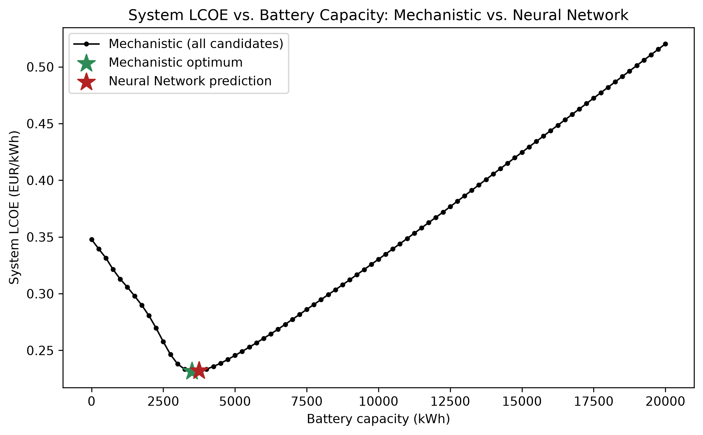
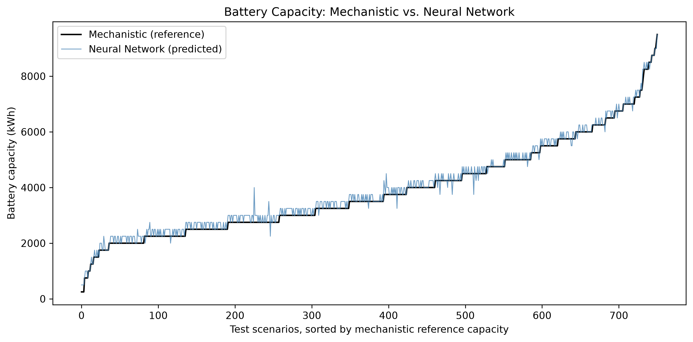

# Battery Sizing for a Diesel-Backed PV–Wind System: Decision-Maker Summary

What this document is: a plain-language summary of a technical study comparing
two ways to decide how big a battery an industrial solar-plus-wind-plus-diesel power
system needs — a traditional engineering calculation ("mechanistic simulation") and a
trained AI model ("neural network"). It is written for investors, project developers,
and policymakers, not engineers. No prior technical knowledge is assumed, and nothing
here requires opening another document.

Study site: an industrial facility in Jinan, China, with 1,800 kW of solar panels,
1,450 kW of wind turbines, a diesel generator sized to cover peak demand, and a
battery to be sized. Full-year (2023) hourly weather and load data were used.

---

## 1. Why Battery Sizing Matters

A battery is the single most expensive, most consequential component to get right in
a solar-plus-wind power system. Too small, and the site burns more diesel fuel than
necessary and pays more for electricity over the system's lifetime. Too large, and
money is spent on battery capacity that mostly sits idle, since a bigger battery
brings diminishing returns once it's already covering the site's daily and weekly
storage needs.

This study found the sizing decision is genuinely two-sided, not "bigger is always
safer." Figure 1 shows this directly: for this project's baseline case, the cost of
electricity produced by the system (measured in Euros per kilowatt-hour, or "system
LCOE" — Levelized Cost Of Energy) starts at 0.287 EUR/kWh with no battery at all,
falls to a low of 0.239 EUR/kWh at a specific battery size, and then climbs back up
again if more battery is added beyond that point. Getting the size right is worth
real money; getting it wrong in either direction costs more than it needs to.

*Figure 1 — The system's cost per kilowatt-hour as battery size increases. The lowest-cost point (19 battery modules, 4,750 kWh) sits in the middle — not at zero battery, and not at the largest battery tested.*

## 2. Comparison of the Two Methods

Method 1, mechanistic simulation, works like a very thorough engineering calculation:
for every possible battery size (this study tested 81 sizes, from none up to 20,000
kWh), it simulates every single hour of a full year — how much solar and wind power
was generated, how much the battery charged and discharged, how much diesel fuel was
burned to cover the rest — and calculates the total cost. It then picks whichever
size gives the lowest cost. This is exhaustive, transparent, and trustworthy, but
each full calculation for one system configuration takes a fraction of a second on
modern hardware — it only becomes slow when it has to be repeated thousands of times
for many different possible projects (different locations, load sizes, equipment
mixes).

Method 2, AI (a trained neural network), is a model trained to predict the answer
mechanistic simulation would give, directly from a project's basic characteristics
(solar capacity, wind capacity, expected electricity demand, and a few other inputs)
— without running the hour-by-hour simulation at all. Once trained, it produces an
answer in a fraction of a millisecond — thousands of times faster than the full
simulation. The catch: it has to be trained on a large number of examples where the
"correct" answer is already known (from the mechanistic method), and its accuracy
depends entirely on how much training data it saw.

Both methods were tested on the same 5,000 example projects, each with different
solar/wind capacities, electricity demand, and equipment specifications, so the
comparison below is apples-to-apples.

## 3. Cost Consequences

The central question for a decision-maker: if you trusted the AI's battery-size
recommendation instead of running the full simulation, how much extra would it cost
you?

This was tested directly. For every test project, the AI's suggested battery size was
priced out and compared against the true lowest-cost size the full simulation found.
The results depended heavily on how much data the AI had been trained on:

- With a small amount of training data (100 example projects), the AI's
  recommendations would have cost, on average, an extra 3.6 cents per kilowatt-hour
  compared to the true optimum — worse than simply guessing the median battery size
  from past projects (which would have cost 2.2 cents extra). At this stage, the AI
  was not yet trustworthy.
- With a larger amount of training data (5,000 example projects), the same AI
  architecture, trained on more examples, would have cost only 0.03 cents per
  kilowatt-hour extra — a negligible amount, essentially free compared to the true
  optimum, and on par with more traditional statistical methods (Ridge regression,
  Random Forest) also tested in this study. Figure 2 shows this well-trained
  comparison across all methods tested.

*Figure 2 — Extra cost incurred, per model, from following its battery-size recommendation instead of the true optimum — after training on 5,000 example projects. Lower is better. The AI (neural network) and Random Forest are statistically tied for cheapest to trust.*

The takeaway for investors: an AI model is only as good as the data used to train it.
A model trained on too few examples can give recommendations that are actively worse
than a naive guess. The same model, given enough training data, becomes essentially
as reliable as the full engineering calculation — while still being thousands of
times faster to run.

Figure 3 shows this agreement directly, in the same style as Figure 1's cost curve, for
one example project rather than a single summary number. It re-draws that same
U-shaped cost curve for a representative project from the test set, then marks two
points on it: the true lowest-cost battery size (green star) and the size the
well-trained AI recommended (red star). The two stars sit almost on top of each
other, right at the bottom of the curve — the AI's recommendation and the true
optimum both land within about 250 kilowatt-hours of each other, and within half a
cent per kilowatt-hour of cost.

*Figure 3 — Cost curve for one representative test project, with the true lowest-cost battery size (green star) and the AI's recommended size (red star) marked. The two stars sit almost on top of each other at the bottom of the curve.*

For a broader check across all 751 test projects at once (not just the one shown in
Figure 3), Figure 4 plots the battery size recommended by the traditional engineering
calculation against the battery size recommended by the well-trained AI, sorted from
smallest to largest project. The two lines follow each other closely across the
entire range, from small batteries (a few hundred kilowatt-hours) to large ones
(nearly 9,500 kilowatt-hours) — this is the well-trained AI's recommendation tracking
the engineering calculation's answer project by project, not just matching it on
average.

*Figure 4 — Battery size recommended by the traditional engineering calculation (black) vs. the well-trained AI (blue), for 751 test projects sorted by the traditional calculation's answer. The two lines track closely across the full range of project sizes.*

## 4. Reliability Risks

A separate, equally important question: does the AI's recommended battery size
actually keep the lights on?

Because this system includes a diesel generator sized to always cover the site's peak
demand, the answer here is reassuring on its own: every battery size tested — no
matter which method chose it, and no matter how accurate that method was — resulted
in 100% reliability. The diesel generator's job is precisely to make sure a
smaller-than-ideal battery never causes an outage; it just burns more fuel to
compensate, which is what shows up as the "extra cost" in Section 3.

This matters practically: a project will not go dark because the AI's battery-size
guess was slightly off. The financial risk from an inaccurate AI recommendation is
real (Section 3), but it is a cost-efficiency risk, not a power-supply risk, as long
as the diesel backup itself is not undersized. (A diesel generator that is
deliberately undersized relative to peak demand — which this study did not
recommend and does not use in its default design — would reintroduce a genuine
reliability risk; this was tested separately as a specific what-if scenario, not as
part of the standard design.)

## 5. When AI Is Useful

AI inference is dramatically faster than the full simulation (Figure 5) — a single
prediction takes a fraction of a millisecond, versus roughly a tenth to a third of a
second for the full simulation. But training an AI model itself takes time and
requires generating training examples with the (slower) mechanistic method first.
This means AI only pays off once it is used enough times to recoup that upfront
cost.

In this study, that break-even point was consistently just above the number of
example projects used to train the model — for a model trained on 100 examples, AI
became worth it after roughly 100–130 total evaluations; for a model trained on 5,000
examples, after roughly 5,000–5,200 evaluations.

Practical translation: AI is worth the investment when a developer or investor needs
to rapidly screen a large number of candidate projects or system configurations —
for example, comparing hundreds of potential sites, or running rapid what-if analysis
across many possible equipment combinations. For a single one-off project evaluation,
the traditional simulation is already fast enough and remains the more directly
trustworthy choice.

*Figure 5 — Time required per evaluation, from slowest (full mechanistic simulation) to fastest (AI inference) — note the scale is logarithmic, so each step down is roughly a 10x-1000x speed difference.*

## 6. When Mechanistic Verification Is Necessary

AI predictions should never be the final word on an actual battery purchase decision
without being checked against the full simulation first. This is not a hedge or a
formality — it is the central, repeated finding of this study.

Even the best-trained AI model in this study, after training on 5,000 examples, still
had prediction errors: on the held-out test set, its battery-size predictions were on
average off by about 99 kWh (against typical project sizes in the thousands of kWh),
and its financial impact, while small (0.03 cents/kWh extra on average), was not
exactly zero for every single project. On a smaller training set, the same model's
errors were large enough to be actively costly. The only way to know which situation
you are in for any given project is to check the AI's answer against the full
simulation — which, given the simulation only takes a fraction of a second per
project, is inexpensive insurance against a wrong AI answer.

The recommended workflow: use AI for fast, first-pass screening across many
candidate projects, then always run the full mechanistic simulation on whichever
candidates are shortlisted for actual investment, before committing capital.

## 7. Interpretability

The two methods differ fundamentally in how much you can trust why they gave a
particular answer.

The mechanistic simulation is fully transparent: every input (weather, equipment
specifications, fuel prices, financing assumptions) and every calculation step is
visible and auditable. If a stakeholder asks "why is 4,750 kWh the recommended
battery size," the answer can be traced exactly: at that size, the trade-off between
battery cost and diesel fuel savings is optimal, and every number behind that
statement can be shown.

The AI model is a "black box" by comparison: it is a mathematical function with over
15,000 internal parameters, learned from examples, with no direct equation a person
can read and interpret. It cannot explain why it recommends a particular battery
size beyond "this is what the pattern in its training data suggests." This is a real
limitation for regulatory, financing, or public-accountability contexts where a
documented, auditable justification is required, not just a number.

## 8. Data Requirements

To use the mechanistic method on a new site, a developer needs: a year of hourly
weather data for that location (solar irradiance, temperature, wind speed — publicly
available for most locations worldwide via satellite/reanalysis data), the site's
expected electricity demand profile, and basic equipment cost assumptions (solar
panel cost, wind turbine cost, battery cost, diesel fuel price). No historical
project database is needed — the simulation works from physics and cost inputs alone.

To use the AI method on a new site (or, more precisely, to build a trustworthy AI
model for a new context), a developer additionally needs a large number of example
projects with known "correct" answers to train on. This study found that roughly
100 examples were not enough for a reliable model; 5,000 examples produced a
reliable one. Generating those examples requires running the mechanistic simulation
thousands of times up front — meaning the AI approach has a real one-time setup cost
in both computing time and mechanistic-method expertise before it can be trusted for
a new context (new geography, new climate, new equipment class).

## 9. Implementation Risks

- Geographic and climate transfer is untested. This entire study used a single
  location (Jinan, China) and a single weather year (2023). Neither method's accuracy
  or reliability has been verified for a different climate, region, or year. Applying
  either method's conclusions to a new geography without re-validating on that
  location's own data would be a real risk, not a safe assumption.
- Cost assumptions are point estimates, not guarantees. Every cost figure used in
  this study (diesel fuel price, battery cost, solar/wind installed cost) is a
  documented planning assumption based on public benchmark data, not a signed
  vendor quote. Actual project economics will shift if real quoted prices differ from
  these assumptions, and this study did not test how sensitive the results are to
  that.
- Equipment specifications are generic, not manufacturer-certified. The wind
  turbine performance curve and solar panel temperature behavior used in this study
  are industry-standard generic models, not specifications from an actual selected
  product. A real procurement process should re-verify sizing against the
  manufacturer's actual certified specifications before finalizing a purchase.
- The AI model's accuracy is specific to this exact problem setup. A change to
  the underlying cost assumptions, equipment choices, or reliability targets would
  make an already-trained AI model's predictions unreliable until it is retrained on
  new examples reflecting the change. AI predictions should not be reused across
  materially different project designs without retraining.

## 10. Recommendations

1. Use the mechanistic simulation as the basis for any actual investment decision.
   It is transparent, auditable, and — at the scale this study tested — fast enough
   (a fraction of a second per candidate) that speed is not a compelling reason to
   skip it for a single project evaluation.
2. Use AI only for fast screening across many candidate projects at once, where
   evaluating hundreds or thousands of configurations with full simulation would be
   impractically slow — and only after confirming the AI model was trained on enough
   representative examples (this study's evidence suggests low hundreds of examples
   is not enough; low thousands was).
3. Always verify an AI-shortlisted project with the full simulation before
   committing capital. This is the single most important operational safeguard
   this study identified — the AI's recommendation should be treated as a
   starting point for further analysis, never as the final sizing decision.
4. Size the diesel backup generator conservatively (at or above the site's peak
   demand). This is what makes the overall system forgiving of an imperfect
   battery-size recommendation, whichever method produced it — reliability risk from
   a wrong AI guess is effectively eliminated as long as the diesel backup itself is
   adequately sized.
5. Before applying these findings to a new site, re-run the underlying analysis
   on that site's own weather and demand data. Every specific number in this report
   (the 0.239 EUR/kWh optimal cost, the 19-module optimal battery size, the accuracy
   figures) is specific to the Jinan, China case study and its particular cost
   assumptions — they should be treated as a demonstrated methodology, not as
   universal figures to copy into a different project.
