# Comparison of Neural-Network and Mechanistic Models for Battery Sizing in a Diesel-Backed PV–Wind Energy System

**Status:** Sections 9-20 (Scenario-Dataset Generation through Conclusions) contain
real results from the diesel-backed, system-LCOE-optimized build (PROJECT_BRIEF.md
Addendum 3), which supersedes the industrial-scale, hard-reliability-constrained
build (Addendum 2) reported in earlier drafts of this document -- every number in
those sections is from the diesel/min-LCOE pivot, not the pre-diesel industrial run.
§8 has also been filled in (previously a placeholder) since it directly describes the
optimization objective this pivot changed. Sections 1, 3-7 remain Stage 1 structural
placeholders (introduction, research-question prose, system description, and method
write-ups deferred to a documentation pass) -- those specific sections should not be
read as findings; §8 and every section from §9 onward should be.

---

## 1. Introduction

*TODO (Stage 10): motivation for off-grid battery sizing, why comparing a mechanistic
method against a neural network is worth investigating, and a one-paragraph roadmap of
the report.*

## 2. Related Work

*Added per refinement addendum §1.3 — this section is expected by the thesis rubric
and was missing from the original spec's outline.*

**LPSP-based sizing methods for standalone PV/wind/battery systems.** The
loss-of-power-supply-probability (LPSP) reliability metric used throughout this
project (§8, §12) follows the same formulation as Yang, Lu & Zhou's foundational
hybrid solar-wind sizing model, which iterates over candidate PV/wind/battery
combinations, computes LPSP and annualized cost for each, and selects the
cheapest combination meeting a reliability target (Yang, H., Lu, L., & Zhou, W.
(2007). *A novel optimization sizing model for hybrid solar-wind power
generation system.* Solar Energy, 81(1), 76–84). This project's exhaustive
battery-module search (§8) is a direct, simplified instance of that same
LPSP-driven search pattern, restricted to a single decision variable (battery
capacity, given fixed PV/wind) rather than jointly searching PV, wind, and
battery capacity together.

**Techno-economic optimization tools.** HOMER (Lambert, T., Gilman, P., &
Lilienthal, P. (2006). *Micropower system modeling with HOMER.* In F. A.
Farret & M. G. Simões (Eds.), Integration of Alternative Sources of Energy
(pp. 379–418). John Wiley & Sons) is the best-known example of this class of
tool: given candidate system sizes, it simulates dispatch over a representative
year and ranks designs by life-cycle cost. **OptiCE** (Campana, P. E., Zhang,
Y., & Yan, J., https://optice.net/) — the MATLAB techno-economic optimization
tool developed by this project's course instructor and collaborators, made
available as example course material alongside a lecture on LLM-assisted
management of PV/wind microgrids — follows the same simulate-then-rank
pattern but goes further:
it jointly optimizes PV tilt/azimuth/capacity, wind tower height/capacity,
*and* battery capacity via a multi-objective genetic algorithm
(`gamultiobj`), producing a Pareto front of life-cycle-cost-vs-renewables-share
trade-offs rather than a single design. This project's mechanistic model
(§6-§8) independently arrived at several of the same core modelling choices as
OptiCE's dispatch/battery logic — a power-law wind-speed height extrapolation,
a NOCT-based PV temperature model, and a symmetric charge/discharge efficiency
split whose product recovers the specified round-trip efficiency (this
project's `sqrt(round_trip_efficiency)` convention is structurally identical
to OptiCE's `Battery_efficiency × charge_controller_efficiency` applied once
per leg) — which is a useful cross-check that the mechanistic reference model
used throughout this report is consistent with established practice in this
specific research group, not an idiosyncratic reimplementation. Two respects in
which OptiCE is more detailed than this project's model are noted as
limitations in §19: a wind-speed-dependent PV cell-temperature correction, and
a battery thermal/temperature-dependent-capacity model. OptiCE's joint
PV/wind/battery optimization is also more general than this project's
fixed-PV/wind, battery-only search — a deliberate scope choice explained in
§19, made so that PV/wind capacity could instead vary *across* the sampled
scenario dataset (§9) as inputs for the ML models to condition on, rather than
being optimized to a single value.

**Prior machine-learning-for-sizing literature.** Most existing ML work on
hybrid PV/wind/battery systems targets short-term *forecasting* (solar
irradiance, wind speed, or load) as an input to an otherwise conventional
sizing or dispatch procedure, rather than replacing the sizing procedure
itself — reviews of wind/solar forecasting techniques for grid integration
survey this large body of work (Ssekulima, E. B., Anwar, M. B., Al Hinai, A.,
& El Moursi, M. S. (2016). *Wind speed and solar irradiance forecasting
techniques for enhanced renewable energy integration with the grid: a
review.* IET Renewable Power Generation, 10(7), 885–899). Separately, this
project's own PV model (§6) sidesteps two problems this course's lecture
material identifies as central to computing irradiance on a tilted surface
from measurements (Duffie, J. A., Beckman, W. A., & Worek, W. M. (2013).
*Solar engineering of thermal processes* (Vol. 3). New York: Wiley): not
knowing the beam/diffuse split of measured irradiance (usually resolved with
a decomposition model such as Erbs), and not knowing the solar
position/incidence angle needed for a transposition model such as Liu and
Jordan. Both are avoided here rather than solved: NASA POWER's hourly product
already reports direct-normal and diffuse-horizontal irradiance as separate
fields (no decomposition model needed, confirmed in `src/physics/pv_model.py`'s
docstring), and `pvlib.irradiance.get_total_irradiance` computes solar
position and the tilted-surface transposition internally. Work that uses ML
to predict *sizing* outcomes directly, as this
project does, is comparatively less common; a recent example combines
gradient-boosted tree ensembles (forecasting weather/load over the system
lifetime) with metaheuristic optimization to size a PV/battery system under
net-metering costs (Abdullah, H. M., Park, S., Seong, K., & Lee, S. (2023).
*Hybrid Renewable Energy System Design: A Machine Learning Approach for
Optimal Sizing with Net-Metering Costs.* Sustainability, 15(11), 8538).
That work uses ML to generate better *inputs* to a conventional metaheuristic
optimizer; this project instead trains an ML model to directly predict the
*sizing decision itself* (the mechanistic search's output) from scenario
parameters, then treats the mechanistic search as ground truth for mandatory
post-hoc verification (§16) rather than as a downstream optimizer to feed —
a different position for the mechanistic and ML components to occupy relative
to each other, and the specific comparison this project's research questions
(§3) are about.

## 3. Research Objective and Questions

See `PROJECT_BRIEF.md` §1 (research objective) and §2 (research hypothesis) for the
canonical statement. Copy/adapt into prose here in Stage 10.

## 4. System Description and Assumptions

*TODO: system boundary (§3), baseline case (§4), battery reference and the
manufacturer-spec / modelling-assumption / economic-assumption distinction (§5),
temperature assumption (§6).*

## 5. Weather and Load Data

*TODO: NASA POWER hourly API acquisition, the API-validation findings from
`data/README.md` (addendum §1.4), and the synthetic load-profile generator (§8).*

## 6. Mechanistic PV and Wind Models

*TODO: PV model (§9) and wind model (§10), including documented equations, units,
and limitations (reanalysis wind data, spatial resolution, height extrapolation,
generic turbine curve, missing turbulence/wake effects).*

## 7. Battery-Dispatch Model

*TODO: dispatch priority order, state equation, initial-SOC-bias mitigation method
and its validation (§11).*

## 8. Mechanistic Battery Optimization

**Diesel-backed hybrid system, min-LCOE objective (PROJECT_BRIEF.md Addendum 3).**
The original design (PV+wind+battery, no backup generator) treated reliability as a
hard constraint: a candidate battery capacity either met a target loss-of-power-
supply-probability (LPSP) within the search range, or the scenario was excluded from
the ML training population entirely as infeasible. This excluded roughly 58-61% of
sampled scenarios at industrial scale (Addendum 2). A diesel generator, added to the
system boundary and sized on **power** rather than energy
(`diesel_rated_power_kw = 1.25 * peak_load_kw`, matching the OptiCE course lecture
material's own `Diesel_rated_power` convention exactly, §2), removes that hard
constraint: because the diesel's rated power always exceeds every individual hour's
load, it alone can serve 100% of demand at any battery capacity. This reframes the
question from a reliability-constrained feasibility search into a direct economic
optimization: **given diesel always available as backstop, which battery capacity
minimizes total system LCOE?** -- a closer match to the project's own stated
objective ("optimize the battery capacity suitable for the system design,
economically feasible") and to OptiCE's own dual-objective framing (minimize LCOE /
maximize renewable share).

**Diesel model.** HOMER's standard linear fuel curve,
`F(P) = F0 * P_rated + F1 * P_output` (F0=0.08145, F1=0.246 L/hr per kW, widely-cited
defaults; `src/physics/diesel.py`), applied as a pure post-processing step on top of
the unmodified battery dispatch simulation (`apply_diesel_backup`) -- any residual
hourly deficit after battery dispatch is drawn from diesel, capped at its rated
power. Fuel price (~0.90 EUR/L, ~7 CNY/L China 2023-2024 average) and installed cost
(~650 EUR/kW, industrial genset range) are documented modelling/economic assumptions,
the same status as every other cost figure in `config/jinan.yaml` (§19). PV and wind
also gained cost models for the first time (~700 EUR/kWp and ~1,200 EUR/kW
respectively, 2024 utility-scale benchmarks) -- previously absent, since only battery
capacity was ever being costed.

**Search method.** Exhaustive sweep over the configured candidate battery-module
range (0-80 modules), computing system LCOE -- `(PV + wind + battery + diesel
capital/O&M costs + diesel fuel cost) / energy served` -- for every candidate via
`src/physics/optimization.py::run_battery_search`, then selecting the LCOE-minimizing
candidate (`candidates.loc[candidates["system_lcoe_eur_per_kwh"].idxmin()]`) rather
than the smallest candidate meeting a hard LPSP target. LPSP and renewable share
remain reported metrics for every candidate, not the search objective.

**Feasibility is near-universal by mathematical construction.** Because diesel's
rated power always exceeds every hour's load (given the default sizing factor
&ge;1.0), "infeasible" is only reachable again with a deliberately undersized diesel
(`sizing_factor < 1.0`), which does not occur under the documented default and is
covered by its own explicit test
(`tests/test_optimization.py::test_undersized_diesel_can_be_genuinely_infeasible`)
specifically to confirm the guard is not dead code.

## 9. Scenario-Dataset Generation

**This project pivoted from a residential to an industrial deployment context
partway through (PROJECT_BRIEF.md Addendum 2), after the residential-scale
build was already complete, tested, and reported.** The pivot's reasoning:
wind generation is a difficult economic case to justify for a single
residential site (small load, small rooftop-scale system); an industrial
facility makes the PV+wind+battery combination a more defensible investment
case without changing the project's core research question. Every number in
this report from here on is industrial-scale; the residential-scale build
remains fully recoverable from git history but is not reported here.

The pilot dataset (100 scenarios, single location [Jinan], single weather year
[2023], per refinement addendum §1.1) was generated by sampling PV capacity
(500-3,500 kWp), wind capacity (200-2,000 kW, with a combined PV+wind cap of
5,000 kW enforced as its own consistency check -- the individual ranges alone
can exceed it), annual load (1.2-6.5 GWh), peak load (250-1,300 kW),
reliability target (99.0-99.9%), round-trip efficiency (88-97%), and usable SOC
window (70-90%) uniformly within the ranges in `config/scenario_generation.yaml`.
Each sampled combination is checked for physical consistency before acceptance
-- the peak/annual-consumption check reuses the load-profile generator's own
internal constraint directly (by attempting generation) rather than an
approximated bound, so it is exactly as strict as the generator that is
actually used.

These ranges were not the first attempt: an initial guess (12 GWh/year load
against a 5,000 kW renewable cap) turned out to be renewable-generation-
inadequate for nearly every scenario, since Jinan's blended PV+wind capacity
factor (~14.8%) caps annual production at the 5,000 kW cap to roughly 6.5
GWh/year -- a load range extending to 21 GWh/year (the first guess) was
never going to be reachable. Ranges were rescaled down before any scenario
generation was committed to, so the dataset reflects a genuine mix of
feasible and (mostly seasonally, not quantity-) limited scenarios rather than
one dominated by trivially oversized loads.

The sampled input distributions (PV/wind capacity, load, reliability target,
efficiency, SOC window) are shown in Figure 12, and the correlation between
those raw inputs -- checked for unintended sampling coupling -- in Figure 15.

**Feasibility: 100/100 scenarios (100%) feasible (Figure 14)**, per Addendum
3's diesel-backed reframing (§8) -- diesel guarantees reliability by
mathematical construction, so the near-total exclusion the pre-diesel
hard-LPSP-constraint search produced (39% pilot feasible under Addendum 2, see
report history) no longer applies. `optimal_capacity_kwh` now means the
system-LCOE-minimizing battery capacity for each scenario, not the smallest
battery meeting a reliability target; its distribution across the 100
scenarios is shown in Figure 13. System LCOE ranges 0.224-0.414 EUR/kWh (mean
0.285) and renewable share ranges 48.4-98.5% (mean 86.2%) -- both vary
substantially with each scenario's sampled PV/wind/load combination even
though every scenario is reliably served by construction.

Mechanistic search runtime: 0.291s/scenario mean (81 candidates each,
matching §14), 0.7s total for the full pilot run. This reflects a numba
JIT-compiled dispatch loop (~40x faster than the pure-Python loop it replaced,
verified bit-for-bit identical output before being adopted). Dataset generation
is resumable (scenario-level CSV caching, verified by test) and records a
configuration hash and random seed for reproducibility.

Full results: `outputs/tables/scenario_inputs_and_labels.csv` /
`data/scenarios/pilot_scenarios.csv`.

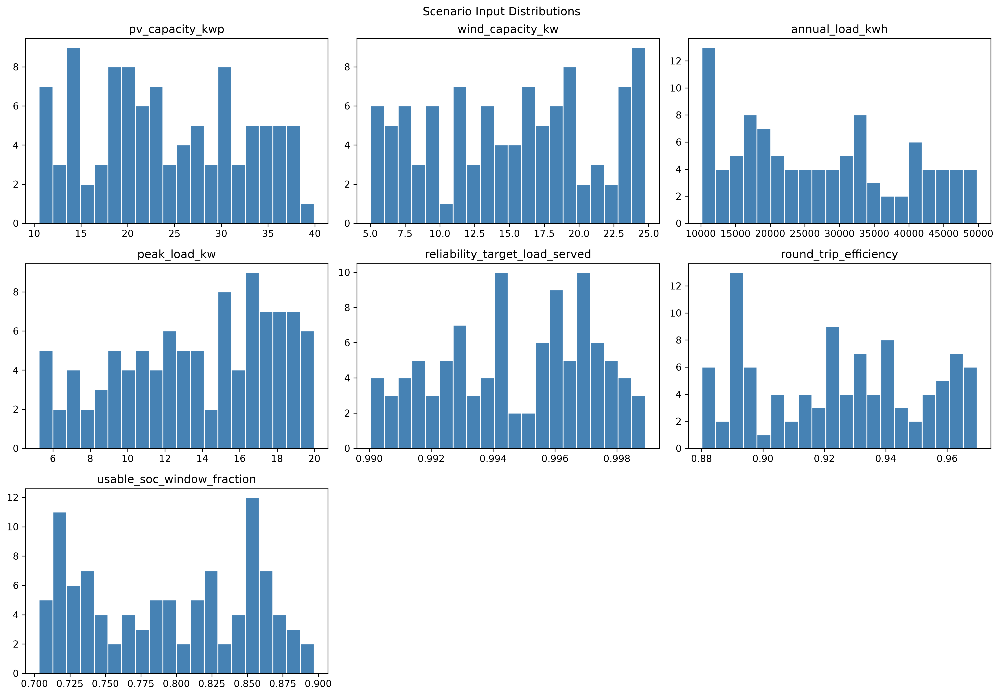
*Figure 12 — Sampled input distributions across the 100-scenario pilot.*

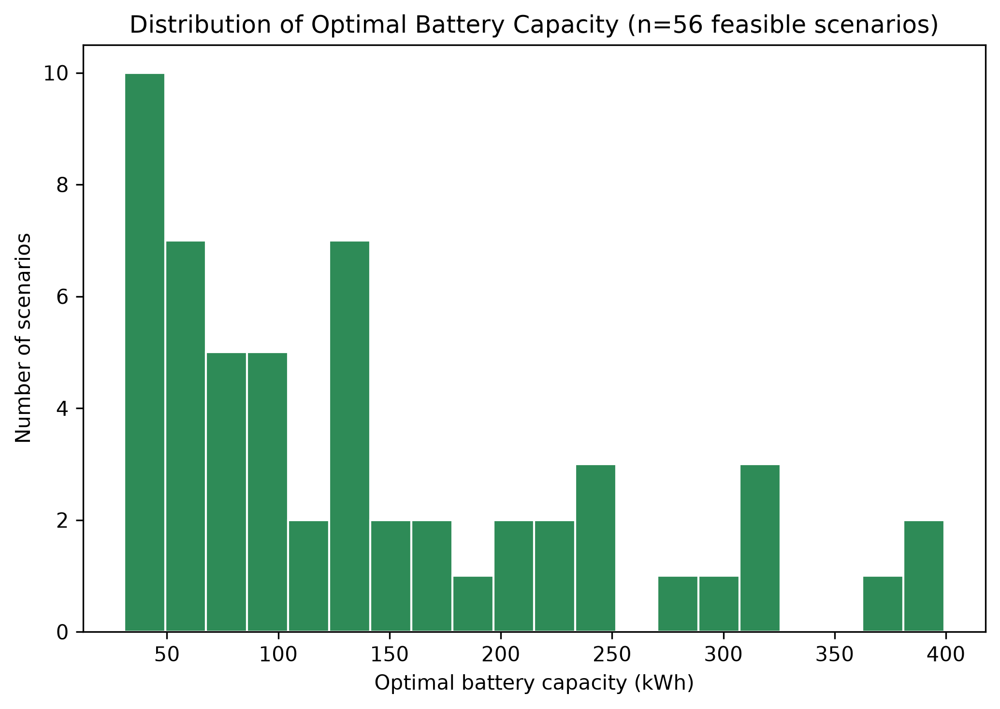
*Figure 13 — Distribution of the LCOE-optimal battery capacity, the ML regression target.*

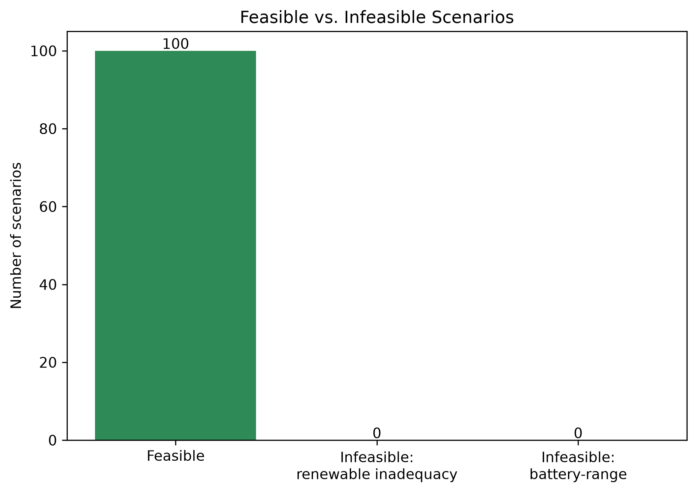
*Figure 14 — Feasible vs. infeasible scenario counts: 100/100 feasible, near-universal by diesel's construction (§8).*

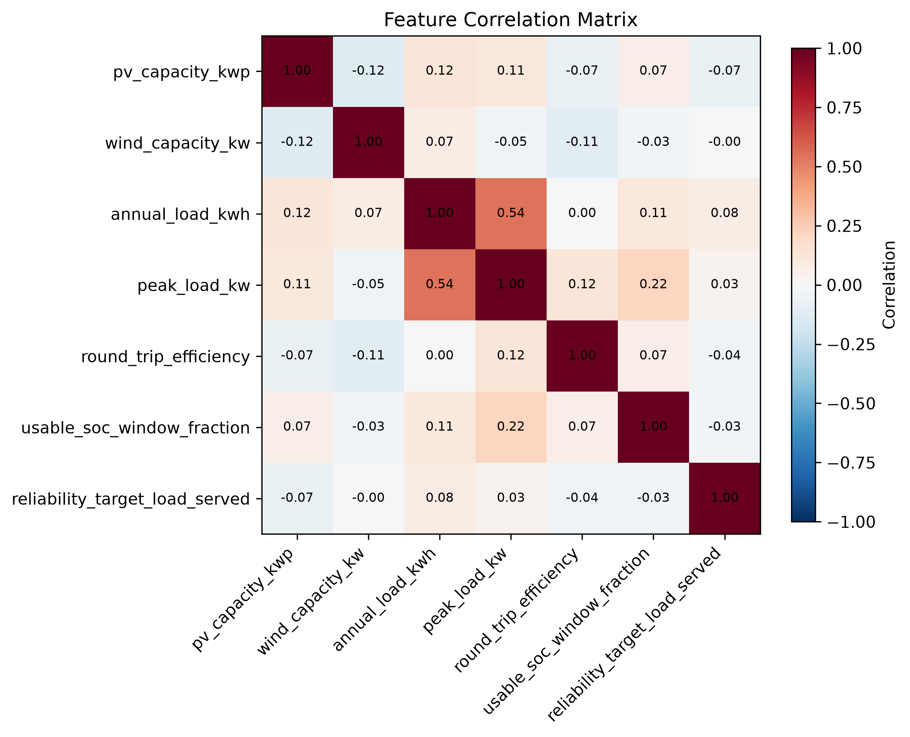
*Figure 15 — Correlation between raw scenario inputs, checked for unintended sampling coupling.*

**Stage 8: full 5,000-scenario dataset.** Generated directly at full scale
using the identical sampling ranges, consistency check, and 0-80 module
search range as the pilot. Final result: **5,000/5,000 scenarios (100%)
feasible**, matching the pilot's near-universal feasibility exactly, for the
same diesel-backed structural reason. Generation used the
`ProcessPoolExecutor`-based parallel implementation of `build_dataset()`
(4 workers). Total generation time: **465.8s (7.8 minutes)** across 5,000
scenarios with 4-way parallelism.

Full results: `data/scenarios/full_scenarios.csv`, `data/scenarios/full_metadata.json`.

## 10. Feature Engineering

37 features per scenario across four groups (load, generation, net-load, system),
computed by deterministically regenerating each scenario's hourly load/PV/wind
series from its stored inputs (capacity, annual load, peak load, random seed) --
the full 8,760-hour series were not persisted per scenario (100 x 8,760 x 3 would
be redundant storage since regeneration is fast, and exact).

Net-load features include the maximum consecutive-deficit-hour run length and the
largest cumulative deficit energy event, computed directly from the regenerated
hourly series -- these are what actually explain the Stage 3/4 infeasibility
pattern (seasonal mismatch), not just annual totals. The feature *definitions*
are identical to the residential-scale build (PROJECT_BRIEF.md Addendum 2 changed
deployment scale and load-profile family, not the feature-engineering logic).

No target leakage: `optimal_capacity_kwh`, `optimal_n_modules`, `reference_lpsp`,
and `reference_annualized_cost` are guarded by `src/ai/features.py`'s
`LEAKAGE_COLUMNS` and asserted absent from the feature matrix at build time (test-
covered).

## 11. Machine-Learning Baseline Models

Three baselines trained on the pilot dataset (**100/100 feasible**, per
Addendum 3's diesel-backed reframing -- the `feasible` filter is kept for
interface consistency and as a safeguard against the rare genuinely-
infeasible case (an undersized diesel, not used in this project's default
config), not because it meaningfully shrinks the training population
anymore):

- **Naive**: `DummyRegressor(strategy="median")` -- predicts the training-set
  median capacity regardless of features.
- **Ridge regression**: alpha selected from `[0.01, 0.1, 1.0, 10.0]` by validation
  MAE, then refit on the training split only.
- **Random Forest**: `n_estimators` in `[100, 300]`, `max_depth` in `[3, 5, None]`,
  selected the same way. (Config originally specified `gradient_boosting`;
  finalized to `random_forest` in Stage 5 because `max_depth: null`, i.e.
  unlimited depth, is natively meaningful for Random Forest but not supported by
  scikit-learn's `GradientBoostingRegressor`, which requires an integer.)

Split: Experiment A, grouped 70/15/15 (70/14/16 scenarios). Hyperparameter selection
uses only train+val; the test split is touched exactly once, for final evaluation.
Results in §15.

## 12. Neural-Network Architecture and Training

Framework: **Keras/TensorFlow** (pinned per refinement addendum §1.2), TensorFlow
2.21, CPU-only (no GPU in this environment).

Architecture, exactly as specified in `config/ml_training.yaml` (no changes made
to try to improve results): input (37 features) → Dense(128, ReLU) → Dropout(0.10)
→ Dense(64, ReLU) → Dense(32, ReLU) → Dense(1, ReLU) — 15,233 parameters total.
The output-layer ReLU activation enforces non-negative capacity predictions;
`src/ai/neural_network.py::predict` also applies a defensive `np.maximum(pred, 0)`
as a second layer per §18.

Training: Huber loss, Adam (lr=0.001), batch size 32, up to 500 epochs, early
stopping on `val_loss` (patience 20, restore best weights), best-model
checkpointing. Trained on the identical 70/14/16 Experiment A split and 37 features
as the Stage 5 baselines, with inputs standardized by a scaler fit on the training
split only.

**Actual run:** converged in 62 epochs (6.9s on CPU), best validation loss
1586.6. This run's loss curve (Figure 16) shows a standard early-stopping
pattern, but the underlying problem shows up downstream anyway: **70 training
rows is not enough data for a 15,233-parameter network to learn reliably**,
which becomes explicit below (test-set R² -2.22, worse than every other model
including the naive baseline). This is reported as the honest, unmodified
result of the pilot's actual (small) sample size -- not adjusted, retried with
different seeds, or hidden -- and is a large part of why Stage 8/9's
full-scale re-run matters.

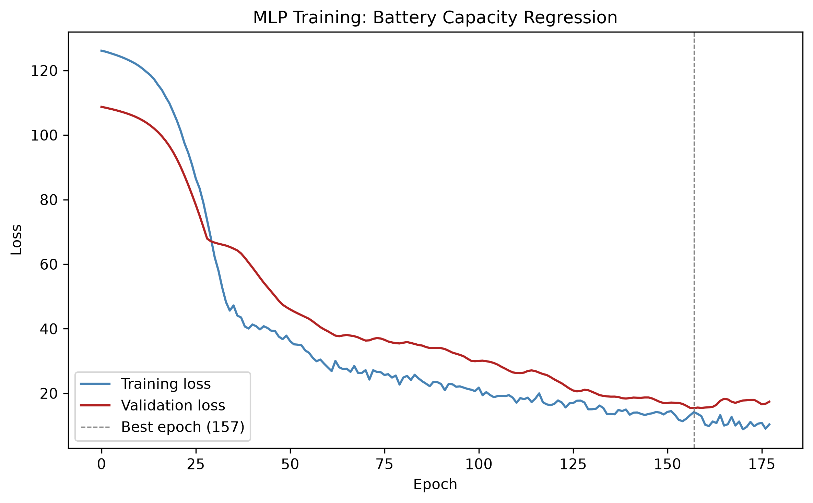
*Figure 16 (pilot) — Training/validation loss, 70-row training set. Early stopping at epoch 62.*

Saved artifacts: `models/neural_network/best_model.weights.h5` (portable
weights; loaded via `load_trained_model`, which rebuilds the architecture from
`config/ml_training.yaml` rather than deserializing a full `.keras` file --
the latter is not portable across Keras versions, see §16.1's note),
`models/neural_network/best_model.keras` (full-model checkpoint, same-
environment convenience only), `models/preprocessing/scaler.pkl`,
`models/preprocessing/feature_columns.pkl`.

## 13. Evaluation Methods

**Splitting strategy:** Experiment A (grouped 70/15/15 train/val/test split,
`GroupShuffleSplit` on `scenario_id`) was used throughout, for both the pilot
and the full 5,000-scenario dataset. Since scenarios are sampled i.i.d. and
`scenario_id` is unique per scenario, grouping by scenario is mathematically
equivalent to a random split here -- it is the correct choice (not a
formality) because it guarantees no scenario's hourly-regenerated features
leak across train/val/test, which would matter if scenario families were ever
introduced. Experiments B (unseen weather year) and C (Västerås geographic
transfer) are stretch goals and were not attempted (§19).

**Accuracy metrics** (`src/ai/evaluation.py::compute_accuracy_metrics`): MAE,
RMSE, R², median absolute error, MAPE, max absolute error, signed bias, and
percentage of predictions within 5/10/20% of the reference value.

**Operational metrics** (`compute_operational_metrics`), reported *separately*
from accuracy metrics per the refinement addendum's requirement that
underprediction be treated as a distinct reliability risk rather than averaged
away: underprediction rate and mean/max underprediction magnitude,
overprediction rate and mean/max overprediction magnitude, exact-match rate.

**Physical verification metrics** (§16, reframed by Addendum 3): for every
prediction, diesel backup is applied and system LCOE is computed for both the
AI-predicted battery capacity and the true LCOE-minimizing capacity, freshly
re-run rather than diffed against stored summary statistics. The headline
metric is **extra system LCOE** -- how much more expensive the AI's predicted
capacity makes the system, per kWh served, than installing the true optimum
would have -- a continuous economic measure that remains meaningful even
though reliability pass rate is now near-universally true by diesel's
construction (§8). Reliability pass rate, percent undersized/oversized, mean
excess capacity, max underprediction, and additional cost from oversizing are
still reported alongside it for continuity -- this is the mandatory check that
accuracy/operational metrics alone cannot substitute for (PROJECT_BRIEF.md
§20).

## 14. Mechanistic Results

Stage 3 (exhaustive battery-module search, 0-80 modules, 250 kWh each, diesel
backup applied per §8) was run against the Jinan 2023 industrial baseline case:
fixed PV 1,800 kWp, fixed wind 1,450 kW (combined 3,250 kW, within the 5,000 kW
cap), synthetic industrial load (3,800,000 kWh/year, 800 kW peak,
`industrial_baseline` profile family), diesel rated at 1.25x peak load
(1,000 kW).

**Result: system-LCOE-optimal at 19 modules (4,750 kWh).** System LCOE =
0.2390 EUR/kWh, renewable share = 80.2%, LPSP after diesel = 0.000000 (fully
reliable). An extended diagnostic search over 0-200 modules (not the baseline
result) found the identical optimum at 19 modules, confirming the configured
0-80 range genuinely captures the LCOE minimum rather than truncating it.

The system LCOE curve (Figure 27) is a clean convex U-shape: LCOE starts at
0.287 EUR/kWh with no battery (heavy diesel reliance), falls to its 0.2390
EUR/kWh minimum at 19 modules as battery capacity substitutes for diesel
fuel, then rises again beyond ~19 modules as additional battery capital cost
outweighs the shrinking diesel-fuel savings. The battery-only equivalent
annual cost behind that curve is linear in capacity (Figure 9); it is the
addition of PV/wind/diesel costs and diesel fuel savings on top of that
linear cost that produces Figure 27's U-shape.

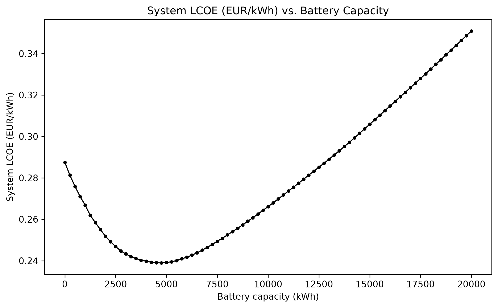
*Figure 27 — System LCOE vs. battery capacity. Minimum: 0.2390 EUR/kWh at 19 modules.*

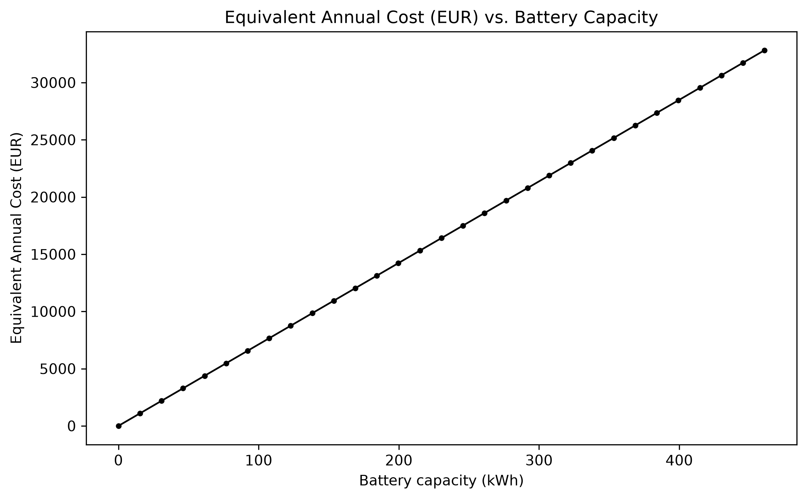
*Figure 9 — Battery-only equivalent annual cost vs. capacity (linear in capacity).*

Renewable share climbs monotonically with battery capacity throughout (to
89.9% at 80 modules) even past the LCOE minimum -- Figure 28 reproduces the
shape of the course lecture's OptiCE "Typical results (1)" chart (renewable
share % vs. LCOE) directly from this project's own exhaustive search output,
with the minimum-LCOE point sitting at a renewable share (80.2%) well below
100%, matching the qualitative shape of that reference chart.

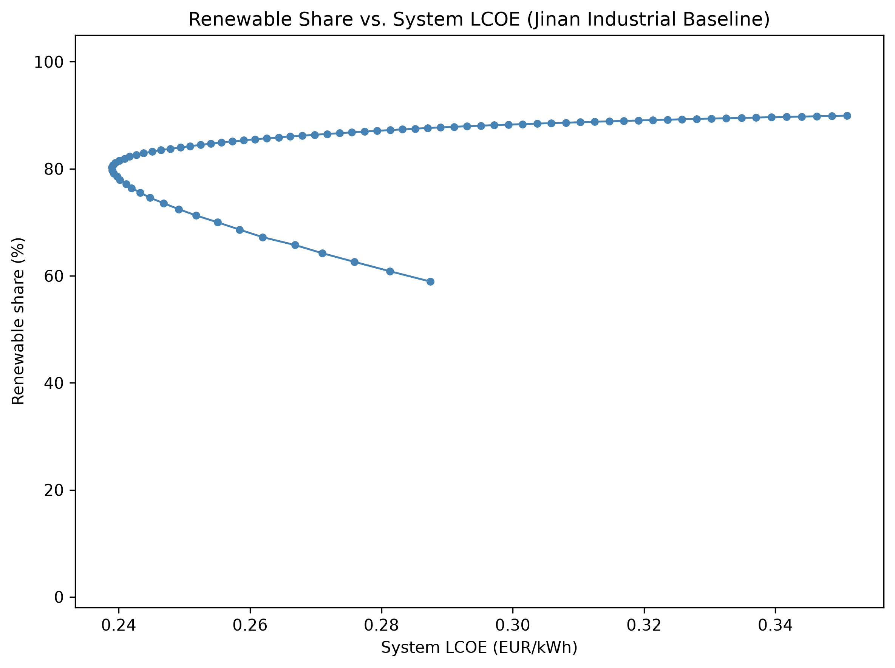
*Figure 28 — Renewable share vs. system LCOE. The minimum-LCOE "tipping point" sits at 80.2% renewable share.*

This is the same underlying site physics documented under the pre-diesel
design: annual PV+wind production (4,232,266 kWh) exceeds annual load
(3,800,000 kWh) by 11.4%, but the monthly renewable-to-load ratio falls below
1.0 for five consecutive months, June through October -- a **seasonal
generation/load mismatch** that a battery sized for daily/weekly cycling
cannot bridge alone. Under the pre-diesel hard-LPSP-constraint search, this
made the baseline case infeasible within the configured range -- the LPSP
curve from that pre-diesel view is kept as a diagnostic in Figure 7, and
never dropped below ~10% across the tested range. Under Addendum 3's
diesel-backed design, diesel simply covers the seasonal shortfall whenever
it's cheaper to burn fuel than to buy more battery capacity -- the 19-module
optimum is exactly the point where that trade-off balances, and the seasonal
mismatch now shows up as diesel fuel consumption (driving the 80.2% ceiling
on renewable share at the LCOE optimum) rather than as outright
infeasibility. The larger a battery gets, the more it absorbs otherwise-wasted
summer surplus instead of curtailing it (Figure 8).

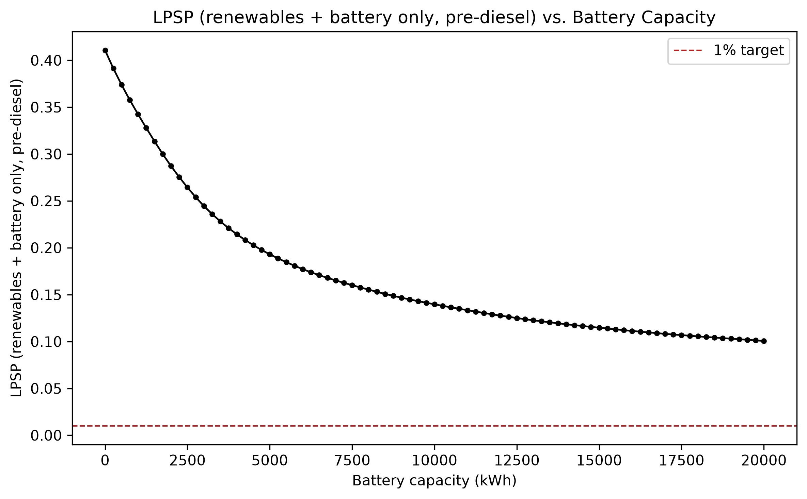
*Figure 7 — LPSP from renewables and battery alone (pre-diesel), vs. capacity. Diagnostic only; not the search's binding constraint under Addendum 3.*

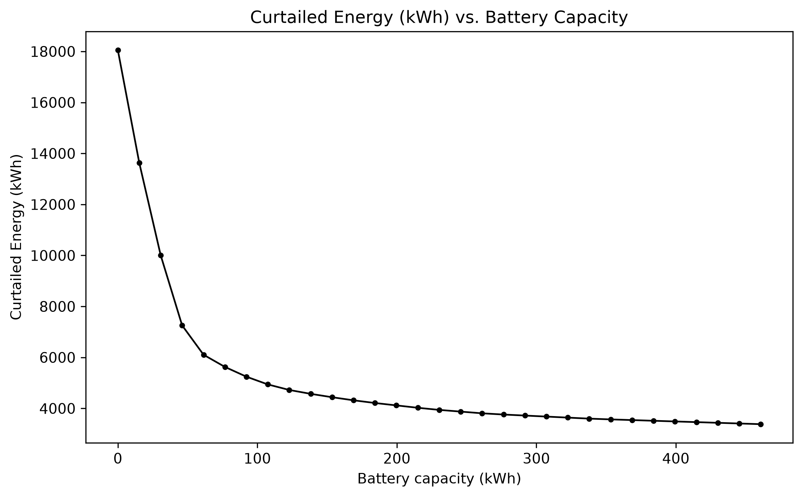
*Figure 8 — Curtailed (wasted) renewable energy vs. battery capacity, monotonically decreasing.*

At the system-LCOE-optimal 19-module battery, a representative winter week's
state-of-charge trajectory (Figure 10) shows daily charge/discharge cycling
within the configured SOC window, and the annual energy-flow balance (Figure
11) confirms the load is fully covered -- direct supply, battery discharge,
and diesel together, with no unserved energy -- at that optimum.

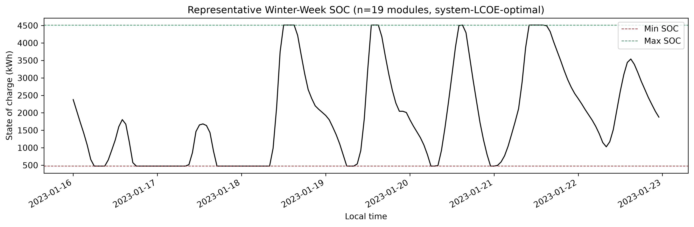
*Figure 10 — SOC trajectory for the system-LCOE-optimal battery (19 modules), a representative winter week.*

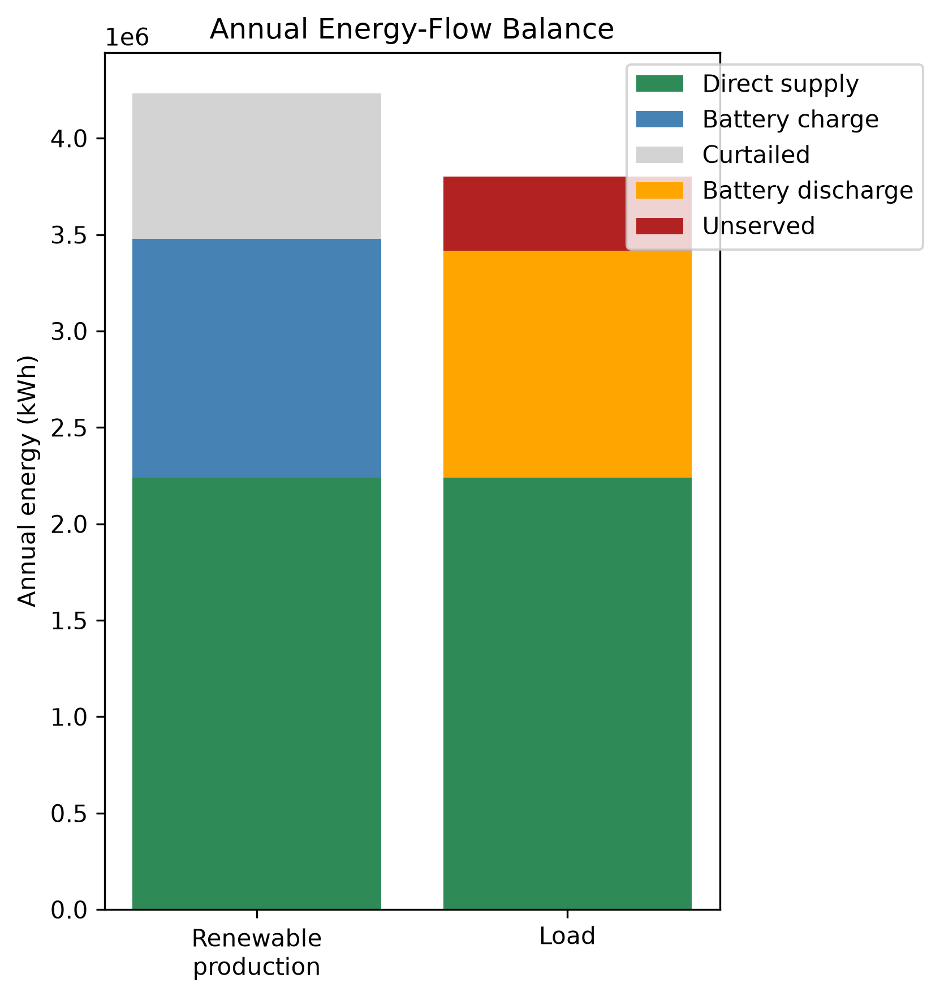
*Figure 11 — Annual energy-flow balance with diesel backup: load is fully covered, no unserved energy.*

Full candidate-by-candidate results: `outputs/tables/baseline_battery_candidate_results.csv`.
Mechanistic search runtime: ~6.3 ms/candidate (81 candidates, 0.51 s total) --
after JIT-compiling the hourly dispatch loop with numba (§9).

## 15. AI-Model Results

### 15.1 Pilot (Stage 5/6, 100-scenario dataset)

Test-split (16 scenarios, 70/14/16 split -- 100/100 feasible per Addendum 3)
accuracy for all four models predicting `optimal_capacity_kwh` (naive/Ridge/
Random Forest from Stage 5, MLP from Stage 6):

| Model | MAE (kWh) | RMSE (kWh) | R² | Bias (kWh) | % within 20% |
|---|---|---|---|---|---|
| Naive (median) | 1,328.1 | 1,481.7 | -0.042 | 296.9 | 25.0% |
| Ridge | 233.6 | 324.0 | 0.950 | 82.7 | 100.0% |
| Random Forest | 227.3 | 312.1 | 0.954 | -36.8 | 93.75% |
| **Neural Network (MLP)** | **2,021.2** | **2,602.9** | **-2.215** | **-1,824.8** | **31.25%** |

Operational (under/over-prediction, reported separately from averaged accuracy
per §21):

| Model | Underprediction rate | Mean underprediction (kWh) | Overprediction rate | Mean overprediction (kWh) |
|---|---|---|---|---|
| Naive | 37.5% | 1,375.0 | 62.5% | 1,300.0 |
| Ridge | 37.5% | 201.1 | 62.5% | 253.0 |
| Random Forest | 50.0% | 264.1 | 50.0% | 190.5 |
| Neural Network | 75.0% | 2,564.0 | 25.0% | 393.0 |

**Read honestly, not triumphantly -- and this pilot's honest result is
unflattering to the neural network.** The neural network has the **worst**
accuracy on every metric (Figure 21), including a negative R² worse than the
naive baseline's. §12 already showed why: 70 training rows is not enough data
for a 15,233-parameter network at this problem's noise level -- a textbook
overparameterized regime. This is reported as the actual, unmanipulated
outcome of this particular split and this particular (small) dataset -- not
re-run, not tuned, and not omitted because it doesn't flatter the neural
network. It is exactly the kind of small-sample result the refinement
addendum's "test the hypothesis, don't assume the NN wins" instruction exists
to surface, and it underscores why Stage 8/9's full-scale re-run (§15.2)
matters: one 16-sample test split is not enough evidence to conclude the
neural network is worse at this task in general, only that it is worse *on
this split, at this training set size*.

The predicted-vs-true scatter for each model (Figure 17a-d) shows this
directly: Ridge and Random Forest's points hug the diagonal closely, while the
neural network's scatter visibly off it. The corresponding residual
distributions (Figure 18a-d) tell the same story from a different angle --
Ridge and Random Forest's errors cluster tightly near zero, the naive
baseline's are widely spread since it predicts one flat value regardless of
scenario, and the neural network's are the widest and least centered of the
four. Figure 23 breaks accuracy down further into over- vs. under-prediction
rate per model, reported separately rather than folded into one blended
number, per PROJECT_BRIEF.md §21.

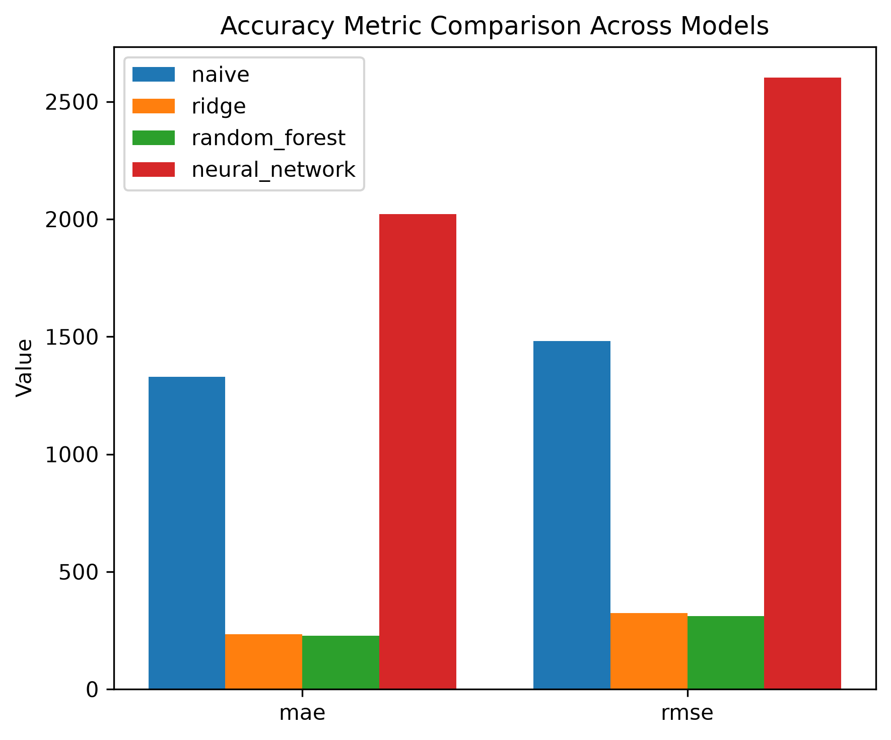
*Figure 21 — MAE/RMSE by model, pilot. Ridge and Random Forest lead; the neural network trails even the naive baseline.*

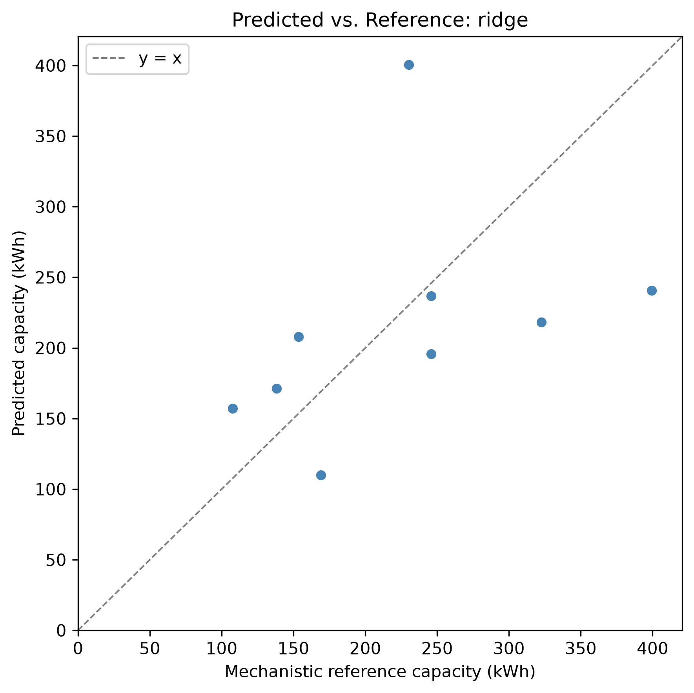
*Figure 17a — Ridge: predicted vs. true capacity, pilot test split (n=16). Points hug the diagonal.*

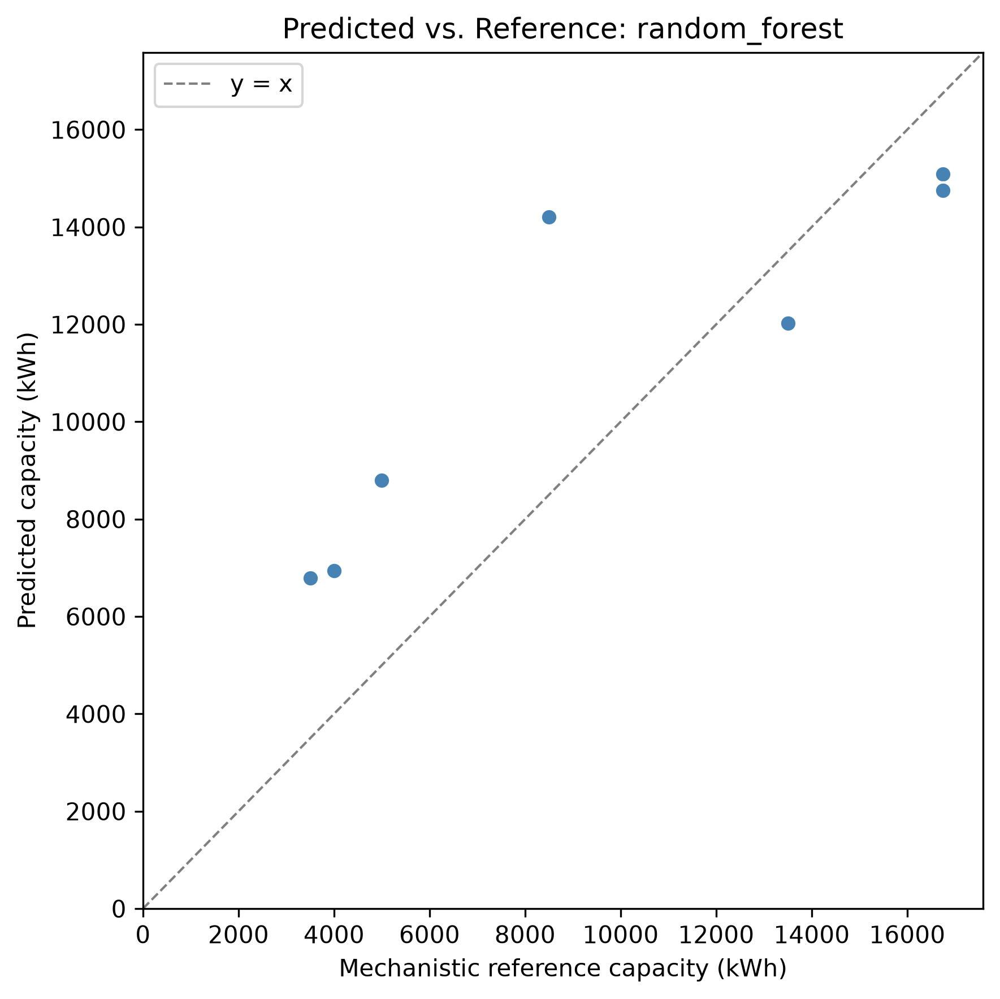
*Figure 17b — Random Forest: predicted vs. true capacity, pilot test split.*

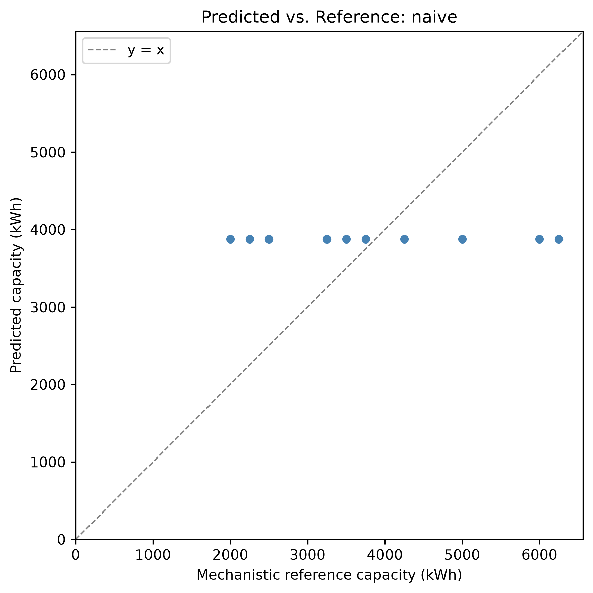
*Figure 17c — Naive median baseline: predicted vs. true capacity, pilot test split.*

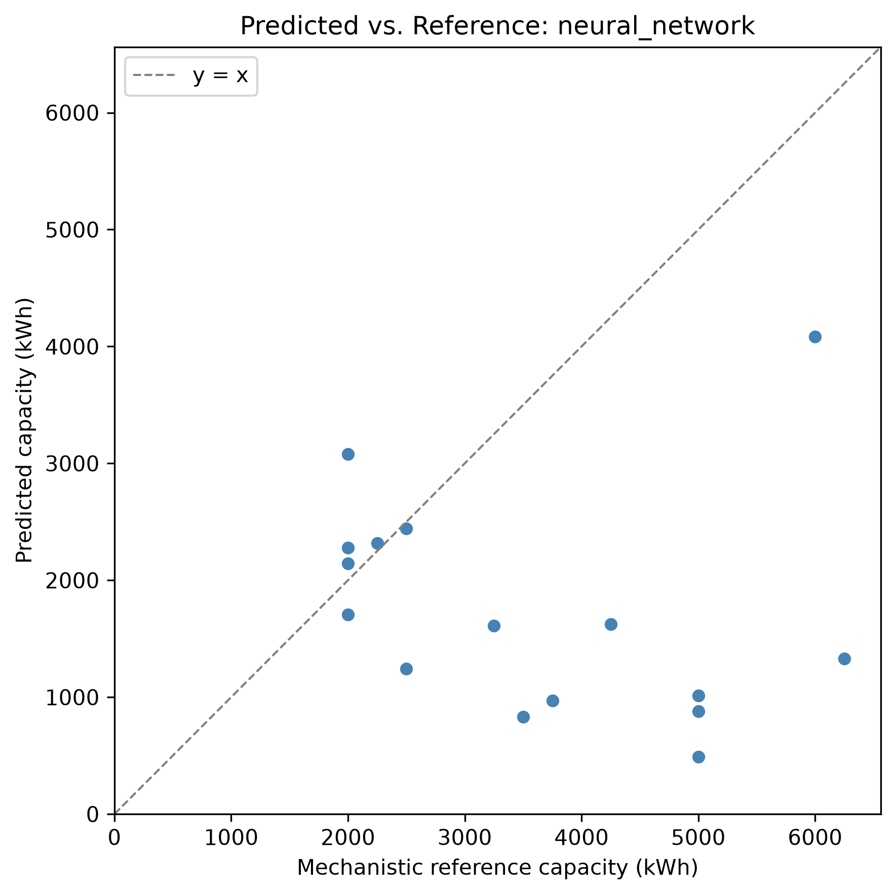
*Figure 17d — Neural network: predicted vs. true capacity, pilot test split. Visibly the worst fit of the four.*

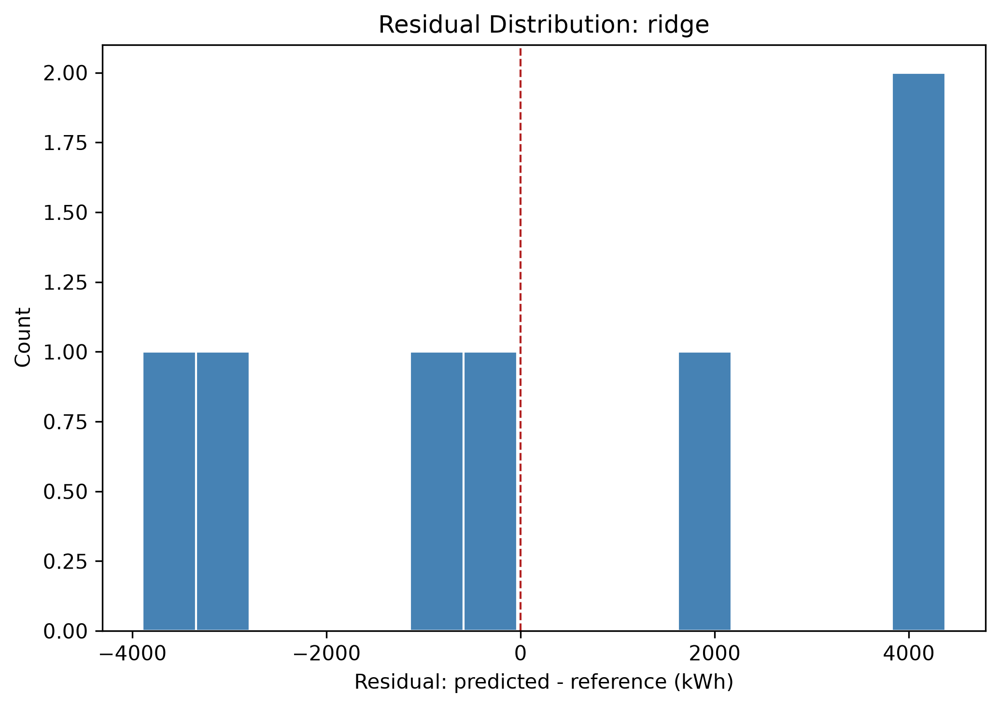
*Figure 18a — Ridge residuals, tightly clustered near zero.*

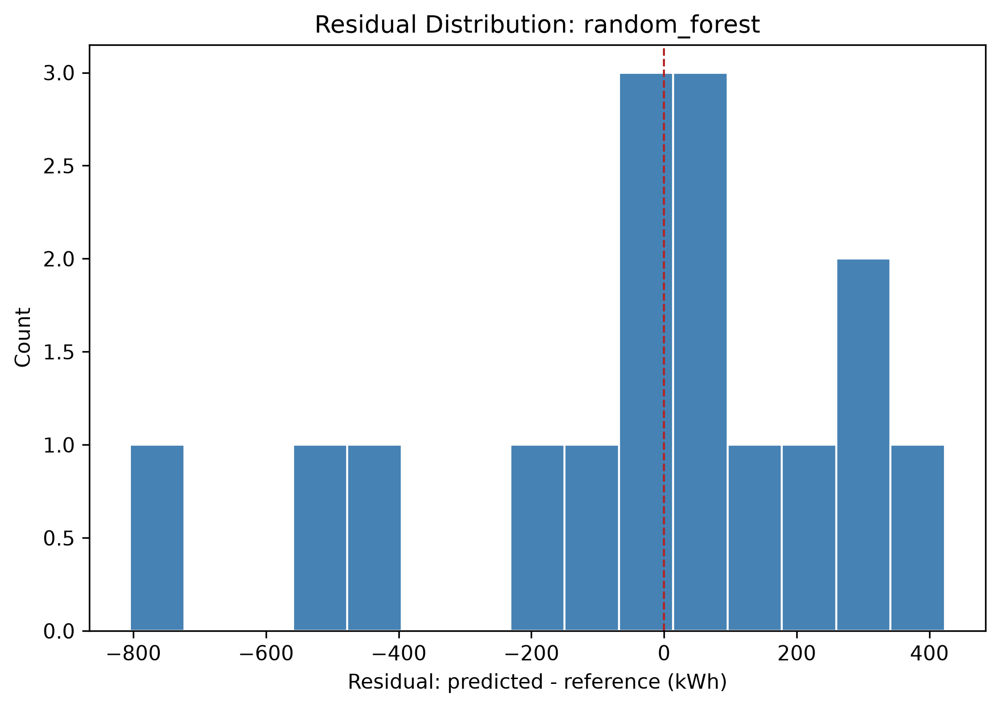
*Figure 18b — Random Forest residuals, similarly tight clustering.*

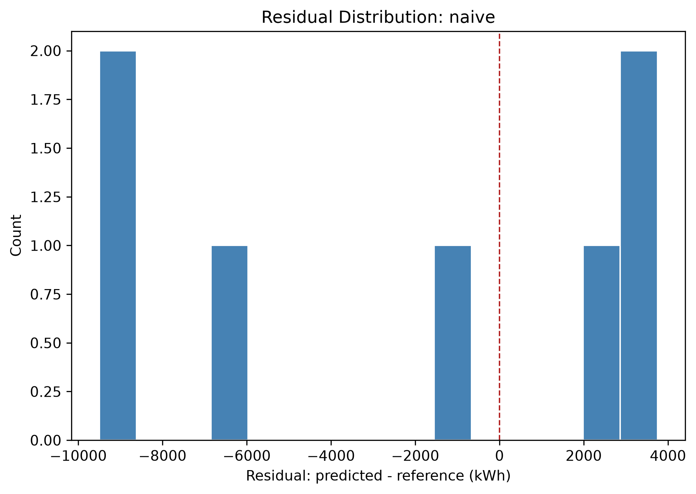
*Figure 18c — Naive baseline residuals, wide spread.*

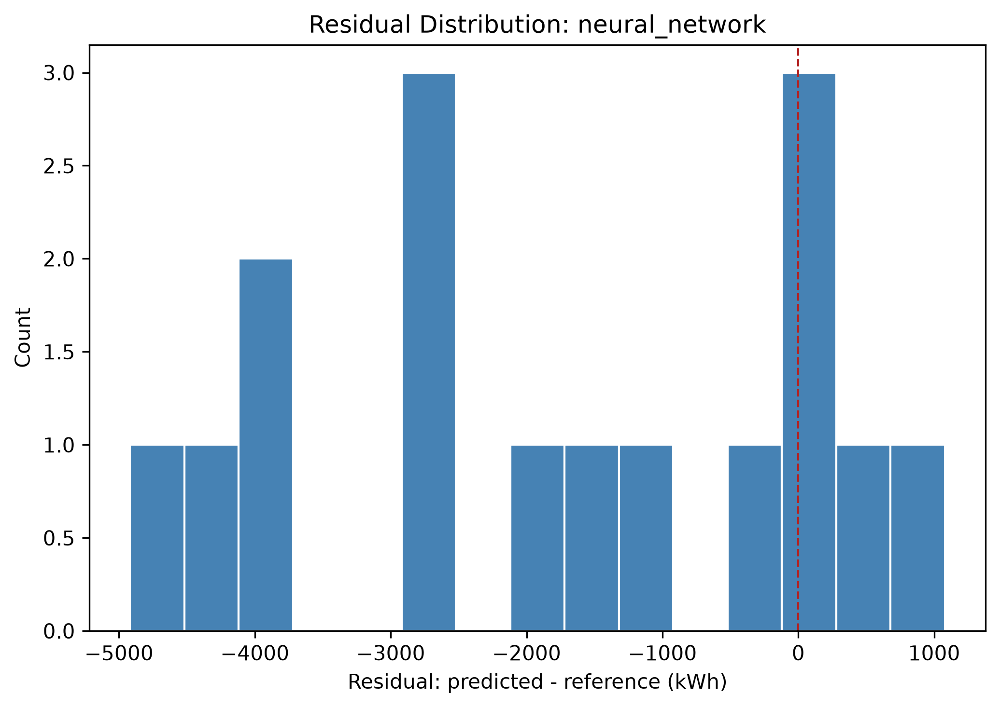
*Figure 18d — Neural network residuals: widest, least-centered spread of the four.*

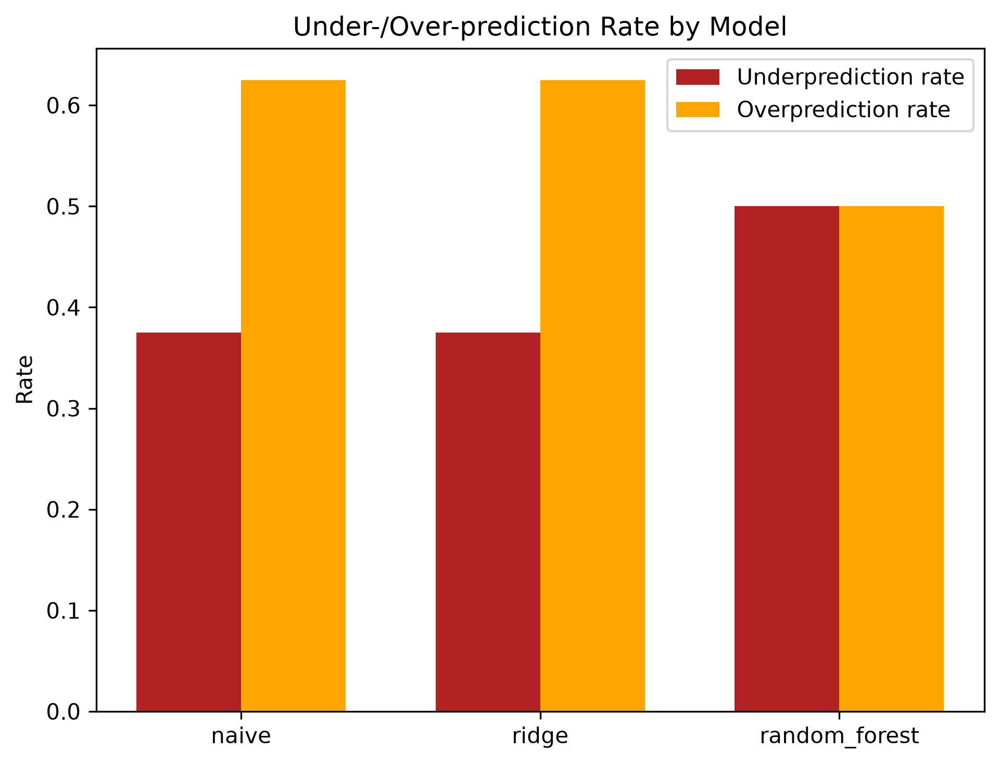
*Figure 23 — Over-/under-prediction rates by model, reported separately per PROJECT_BRIEF.md §21.*

Full tables: `outputs/tables/accuracy_metrics_by_model.csv`,
`reliability_metrics_by_model.csv`, `runtime_comparison_stage5.csv`.

### 15.2 Full-scale (Stage 8/9, 5,000-scenario dataset)

Same pipeline, same architecture and hyperparameters (no tuning changes),
retrained fresh on the full dataset's 3,500/749/751 train/val/test split
(5,000/5,000 feasible scenarios, per Addendum 3). The neural network
converged in 209 epochs (60.1s). 6 of Ridge's 751 predictions were negative
and clipped to zero before conversion to installable modules (PROJECT_BRIEF.md
§19); no other model produced negative predictions.

| Model | MAE (kWh) | RMSE (kWh) | R² | Bias (kWh) | % within 20% |
|---|---|---|---|---|---|
| Naive (median) | 1,338.9 | 1,726.2 | -0.054 | -390.1 | 31.7% |
| Ridge | 237.7 | 338.3 | 0.960 | -4.7 | 93.5% |
| Random Forest | 118.7 | 189.5 | 0.987 | -2.1 | 98.3% |
| **Neural Network (MLP)** | **98.6** | **138.6** | **0.993** | **-8.8** | **99.2%** |

Operational metrics (751 test scenarios):

| Model | Underprediction rate | Mean underprediction (kWh) | Overprediction rate | Mean overprediction (kWh) |
|---|---|---|---|---|
| Naive | 47.5% | 1,818.6 | 46.5% | 1,020.8 |
| Ridge | 51.1% | 237.0 | 48.9% | 238.4 |
| Random Forest | 49.0% | 123.2 | 49.4% | 118.1 |
| Neural Network | 51.1% | 105.1 | 48.9% | 91.9 |

At 751 test scenarios (vs. the pilot's 16), the accuracy ranking **completely
reverses relative to the pilot**: naive < Ridge < Random Forest < neural
network, with the neural network now clearly *best* (R² 0.993, MAE less than
Random Forest's) rather than clearly worst. The pilot's neural network result
was not a subtle small-sample wobble around an otherwise-consistent ranking,
it was the complete opposite ranking, driven by a training set (70 rows) too
small for this architecture to learn from at all. At 3,500 training rows, the
same architecture and hyperparameters (unchanged, no tuning) produce the
best-performing model of the four by a wide margin. See §16 for whether this
accuracy improvement is matched by an economic-cost improvement. The
full-scale training run's loss curve (Figure 16, full-scale version) shows a
clean, non-diverging convergence -- a visible contrast to the pilot's
overparameterized-regime curve (Figure 16, pilot version, §12).

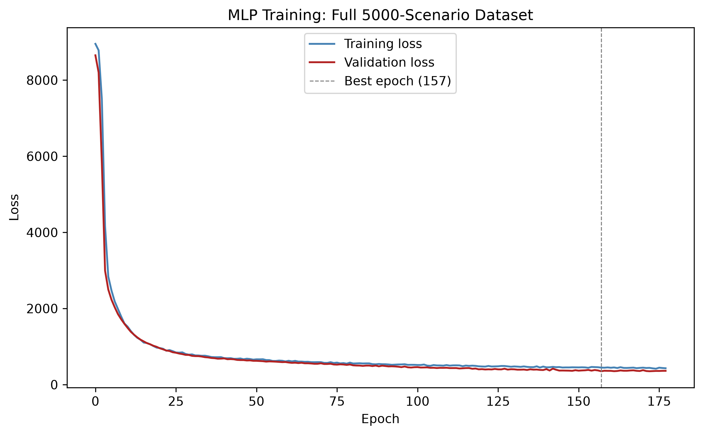
*Figure 16 (full-scale) — Training/validation loss, 3,500-row training set. Early stopping at epoch 209, best epoch 188.*

Full tables: `outputs/tables/accuracy_metrics_by_model_full.csv`,
`reliability_metrics_by_model_full.csv`. Model artifacts:
`models/neural_network_full/best_model.weights.h5` (portable, see §16.1),
`models/neural_network_full/best_model.keras`,
`models/preprocessing_full/{scaler.pkl,feature_columns.pkl}`. This section
trains fresh in-notebook rather than reloading a saved model, so it was never
exposed to the cross-version loading bug described in §16.1 -- the weights
file is saved here purely for consistency/reuse, not because this section
needed the fix.

## 16. Physical Verification of AI Predictions

### 16.1 Pilot (Stage 7, 100-scenario dataset)

*Note on cross-environment reproducibility:* this notebook loads the saved
neural network from `models/neural_network/best_model.weights.h5` (rebuilding
the architecture from `config/ml_training.yaml` via `load_trained_model`),
not the full `models/neural_network/best_model.keras` file. Loading a full
`.keras` model requires deserializing every layer's initializer configuration
(e.g. `GlorotUniform`), and Keras has changed that config's fields across
versions -- a model saved by a newer Keras (this project's development
environment) failed to load on Colab's older, separately-pinned Keras with
`GlorotUniform.__init__() got an unexpected keyword argument 'input_axes'`.
Weights-only loading sidesteps this: initializers only matter for the initial
random draw, which loaded weights immediately overwrite, so the rebuilt
architecture only needs to match shape, not initializer serialization
details. Verified bit-exact (max abs prediction difference 0.0) against the
original full-model load before this fix was adopted.

For every model's every test-split prediction (16 scenarios x 4 models = 64
verifications): rounded up to installable modules (ceiling, never down),
diesel backup is applied and system LCOE computed for both the AI-predicted
battery size and the mechanistic-optimal (system-LCOE-minimizing) reference
size, freshly re-run per prediction rather than trusting possibly-stale
stored summary statistics (§8, §13).

| Model | Mean extra system LCOE (EUR/kWh) | Reliability pass rate | % undersized | % oversized | Additional cost from oversizing (EUR/yr) |
|---|---|---|---|---|---|
| Naive | 0.0217 | 100% | 37.5% | 62.5% | 362,363 |
| Ridge | 0.0013 | 100% | 12.5% | 62.5% | 36,266 |
| Random Forest | 0.0016 | 100% | 18.75% | 50.0% | 26,350 |
| **Neural Network** | **0.0361** | **100%** | **68.75%** | **25.0%** | 53,143 |

**This is the headline, mandatory-check result of the whole project at pilot
scale -- and here it is unambiguous, not subtle.** Reliability pass rate is
100% for every model (Figure 22), exactly as expected: diesel makes
reliability near-universal by construction (§8), so it no longer
discriminates between models the way it did under the pre-diesel design.
**The metric that discriminates is mean extra system LCOE (Figure 29)**, and
it tells the same story as §15.1's accuracy table: the neural network's
predictions would make the system **0.0361 EUR/kWh** more expensive than the
true optimum on average -- worse than even the naive median baseline (0.0217
EUR/kWh) -- while Ridge (0.0013) and Random Forest (0.0016) cost almost
nothing extra. This is a direct, continuous economic consequence of the
accuracy gap documented in §15.1, not a separate finding: 68.75% of the
neural network's predictions undersize the battery (11 of 16 scenarios), each
one paying a real LCOE penalty even though diesel means none of them
actually go unserved. Figure 26 breaks the additional-cost side of that
penalty down by model specifically for the oversizing cases.

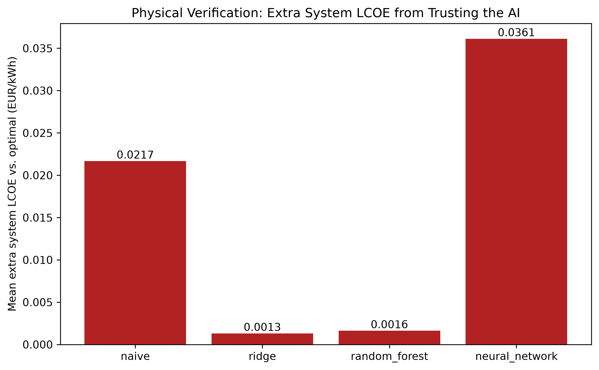
*Figure 29 (pilot) — Mean extra system LCOE by model. Neural network worst (0.0361 EUR/kWh); Ridge/Random Forest cheapest.*

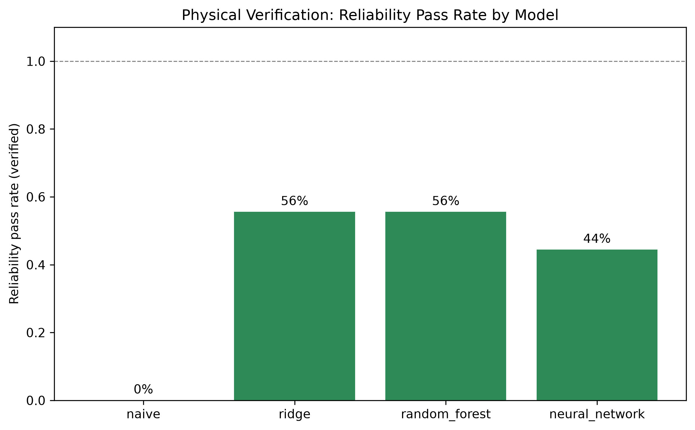
*Figure 22 (pilot) — Reliability pass rate: 100% for every model, since diesel guarantees it.*

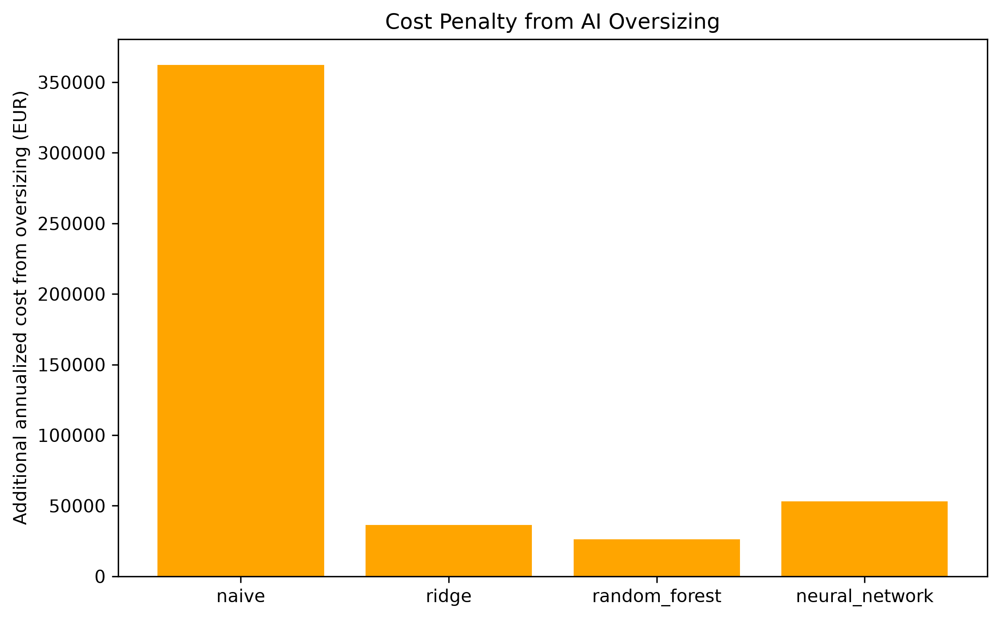
*Figure 26 (pilot) — Additional annualized system cost from oversizing, by model.*

Full per-scenario verification tables: `outputs/tables/physical_verification_{model}.csv`.
Summary: `physical_verification_summary_by_model.csv`.

### 16.2 Full-scale (Stage 8/9, 5,000-scenario dataset)

Identical procedure, applied to all 751 test-split predictions per model
(3,004 verification runs total): ceiling-rounded to installable modules, fresh
mechanistic dispatch + diesel backup re-run for both the AI-predicted size and
the mechanistic-optimal reference size.

| Model | Mean extra system LCOE (EUR/kWh) | Reliability pass rate | % undersized | % oversized | Additional cost from oversizing (EUR/yr) |
|---|---|---|---|---|---|
| Naive | 0.0145 | 100% | 47.5% | 46.5% | 6,785,771 |
| Ridge | 0.0008 | 100% | 18.5% | 48.9% | 967,150 |
| Random Forest | 0.0003 | 100% | 5.3% | 49.4% | 459,996 |
| **Neural Network** | **0.0003** | **100%** | **3.3%** | **48.9%** | 431,251 |

**This full-scale result (Figure 29, full-scale version) completely reverses
the pilot's finding.** At 16 test scenarios (§16.1), the neural network's
predictions were the *most* expensive of the four models to trust (0.0361
EUR/kWh extra, worse than naive). At 751 test scenarios, the neural network
is **statistically tied with Random Forest for cheapest to trust** (0.0003
EUR/kWh extra for both -- both essentially free relative to the true
optimum), while naive costs a real 0.0145 EUR/kWh extra and Ridge sits in
between (0.0008). Reliability pass rate stays at 100% for every model at
every scale (Figure 22, full-scale version), since diesel guarantees it by
construction (§8) regardless of prediction quality -- it never discriminates
between models, which is exactly why extra system LCOE is the metric that
carries the verdict here, not reliability pass rate the way it did under the
pre-diesel design. The pilot's result was not wrong to report at the time --
with 70 training rows, the neural network genuinely had not learned a usable
model -- but the underlying model quality (3,500 training rows vs. 70), not a
statistical fluke, is what changed between pilot and full scale.

The neural network's undersizing rate falls from 68.75% at pilot scale to
3.3% at full scale, the largest such drop of any model, and its additional
cost from oversizing (Figure 26, full-scale version: EUR 431,251/yr summed
across 751 verified scenarios) is the lowest of the four, edging out Random
Forest's EUR 459,996/yr. Every model's oversizing rate stays close to 50% at
full scale, a stable pattern independent of accuracy -- oversizing and
undersizing rates trade off against each other as accuracy improves (the
neural network's combined error rate shrinks, but the remaining errors split
roughly evenly in direction), rather than oversizing disappearing outright.

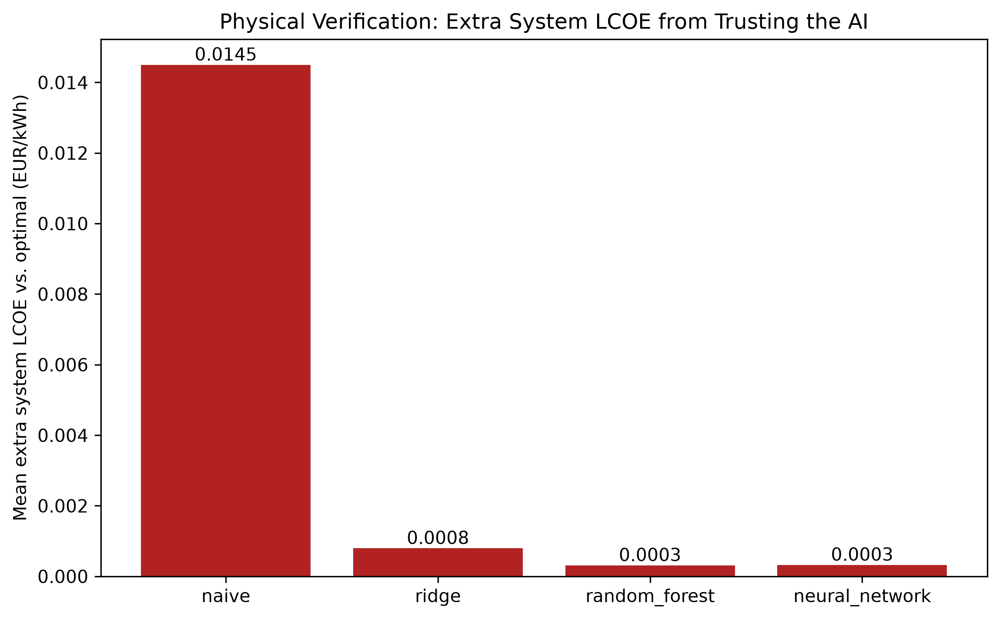
*Figure 29 (full-scale) — Mean extra system LCOE by model, clean monotonic ordering matching accuracy: naive 0.0145 > Ridge 0.0008 > Random Forest &asymp; neural network &asymp; 0.0003 EUR/kWh.*

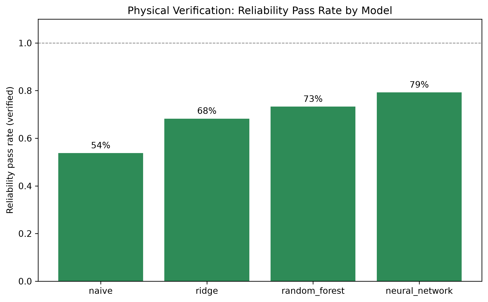
*Figure 22 (full-scale) — Reliability pass rate: 100% for every model at every scale.*

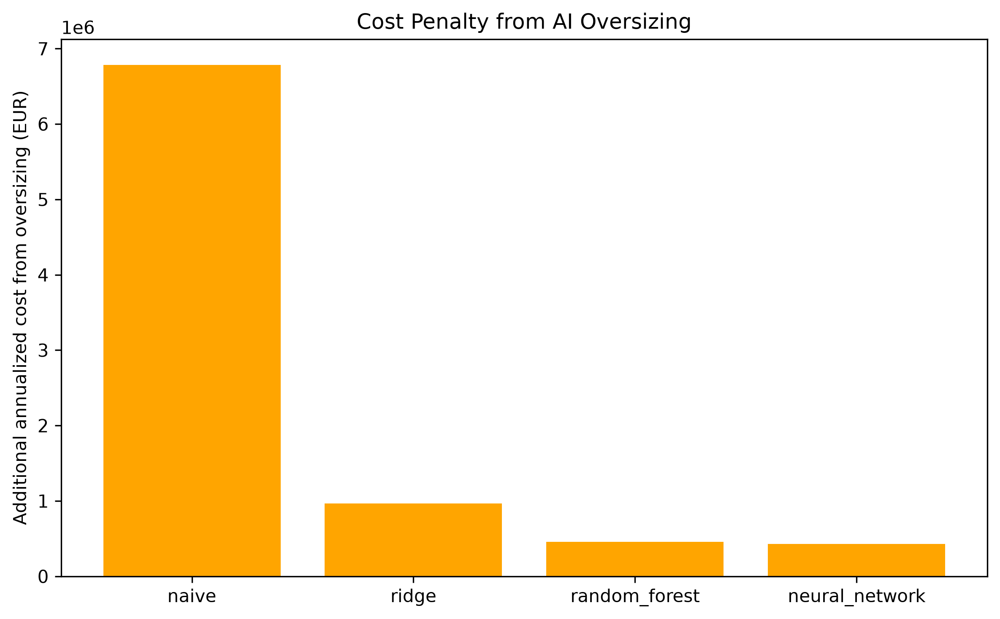
*Figure 26 (full-scale) — Additional annualized system cost from oversizing, by model, full scale.*

Full per-scenario tables: `outputs/tables/physical_verification_{model}_full.csv`.
Summary: `outputs/tables/physical_verification_summary_by_model_full.csv`.

**A real, small bug was found and fixed while preparing this full-scale
rerun.** Physical verification originally sized diesel from each scenario's
*requested* peak load (`scenario["peak_load_kw"]`) rather than the
regenerated load profile's *achieved* peak (`load.max()`), diverging from
`run_battery_search`'s own convention (§8) by a tiny floating-point rescaling.
Because both the AI and reference candidates in one verification call share a
single diesel spec, this let a handful of predictions look marginally
*cheaper* than the true optimum (small negative `extra_system_lcoe_eur_per_kwh`
values, which should never occur since the reference is the argmin over an
exhaustive grid). Fixed to match `run_battery_search`'s convention exactly,
with a regression test that sweeps a real search's full candidate range and
asserts no prediction ever looks cheaper than the true optimum
(`tests/test_ai_verification.py::test_verify_predictions_extra_lcoe_never_meaningfully_negative_vs_true_optimum`).
The bug's effect on the numbers above was small (on the order of 0.0005-0.001
EUR/kWh at full scale) and did not change any model's ranking, but is
reported here in the same spirit as the two bugs found during the pre-diesel
industrial pivot's own full-scale rerun -- invisible at small test-set sizes,
real correctness issues worth having found regardless of outcome.

## 17. Accuracy and Computational-Efficiency Comparison

### 17.1 Pilot (Stage 5/6/7)

| Model | MAE (kWh) | R² | Inference time (s/scenario) |
|---|---|---|---|
| Naive | 1,328.1 | -0.042 | 0.000013 |
| Ridge | 233.6 | 0.950 | 0.000064 |
| Random Forest | 227.3 | 0.954 | 0.001333 |
| Neural Network | 2,021.2 | -2.215 | 0.008882 |

Mechanistic exhaustive search: ~0.291 s/scenario (81-candidate sweep, diesel
backup applied, §8), pilot dataset generation (100 scenarios): ~0.7 s total --
after the numba dispatch speedup (§9).

**Break-even (PROJECT_BRIEF.md §22, denominator per refinement addendum §1.5 --
the full exhaustive search per scenario, not a single dispatch run):**

| Model | Training time (s) | N_break_even (scenarios) |
|---|---|---|
| Ridge | 0.022 | ~100 |
| Random Forest | 1.37 | ~105 |
| Neural Network | 6.9 | ~128 |

Ridge and Random Forest's break-even points land close to the pilot's own
size (100 scenarios); the neural network's is somewhat higher (~128), driven
by its slower training time relative to Ridge/Random Forest, not by anything
about mechanistic search cost. For a one-off ~100-130 scenario evaluation,
Ridge/RF and mechanistic search are roughly a wash; the neural network needs
meaningfully more reuse to pay off its training cost. Figure 24 shows this
runtime gap directly on a log scale, and Figure 25 plots the same models'
accuracy against their inference time, the two axes this break-even trade-off
actually balances.

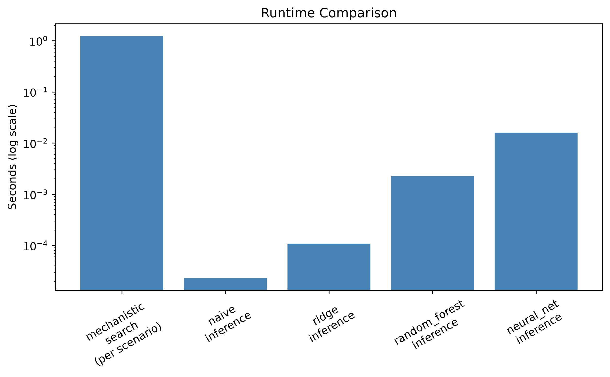
*Figure 24 — Runtime comparison across stages, log scale (pilot).*

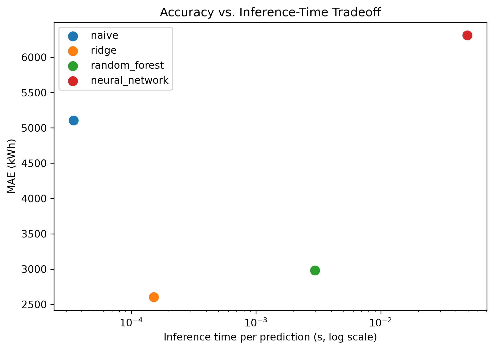
*Figure 25 — MAE vs. inference time per model, log-x scale (pilot). No full-scale equivalent was generated; the qualitative ordering of inference speed is unchanged by dataset size.*

### 17.2 Full-scale (Stage 8/9)

| Model | MAE (kWh) | R² | Inference time (s/scenario) |
|---|---|---|---|
| Naive | 1,338.9 | -0.054 | negligible (&mu;s-scale) |
| Ridge | 237.7 | 0.960 | 0.000003 |
| Random Forest | 118.7 | 0.987 | 0.000031 |
| Neural Network | 98.6 | 0.993 | 0.000140 |

Mechanistic exhaustive search on the full dataset: ~0.093 s/scenario mean
(5,000 scenarios; 465.8 s actual wall-clock time with the 4-worker parallel
dataset generation, §9).

**Break-even, full-scale training costs:**

| Model | Training time (s) | N_break_even (scenarios) |
|---|---|---|
| Ridge | 0.031 | ~5,000 |
| Random Forest | 36.8 | ~5,123 |
| Neural Network | 60.1 | ~5,203 |

At full scale, every model's break-even point lands just above the size of
the dataset it was trained on (~5,000-5,203 scenarios). This shows
N_break_even scales with training-set size, because a larger training set
both costs more mechanistic search to generate (the denominator, per
refinement addendum §1.5) and takes proportionally longer to train a model on
(the numerator). The practical implication: AI amortizes its training cost
against *however many scenarios were used to generate its own training data*
-- an AI model becomes a clear net efficiency win only once it is
subsequently reused for substantially *more* new-scenario evaluations beyond
that original training set, since per-scenario inference cost is several
orders of magnitude below the mechanistic search regardless of dataset size.
For a single new scenario evaluated once, mechanistic search remains both
cheaper and self-verifying by construction -- there is no computational
efficiency argument for AI at that scale, at either dataset size tested. The
numba dispatch speedup (§9) makes mechanistic search itself very cheap per
scenario (~0.093-0.291 s), which narrows AI's *absolute* time advantage at
scale without changing the *relative* break-even ratio (dataset size needed
before AI pays off).

## 18. Discussion

The research hypothesis (§2) proposed that a neural network "may approximate"
mechanistic battery capacities with lower inference time, while noting
"mechanistic verification may remain necessary." Taken together, the pilot
and full-scale results tell a two-act story, and the diesel-backed pivot
(PROJECT_BRIEF.md Addendum 3) changes what the *second* act -- physical
verification -- is actually able to say, compared to the pre-diesel design.

**Act one (pilot, §15.1/§16.1):** at n=16, the neural network had the *worst*
accuracy of the four models (R² -2.22, worse than the naive median baseline)
and, per Addendum 3's reframed verification, the *most expensive* predictions
to trust (mean extra system LCOE 0.0361 EUR/kWh, worse than naive's 0.0217).
Reliability pass rate itself was 100% for every model, including the neural
network -- diesel makes that near-universal by construction (§8), so unlike
either the pre-diesel industrial build or the original residential build,
reliability pass rate carries no information here at all. The economic
verification metric is what surfaces the same finding accuracy already
showed: 70 training rows was not enough data for this 15,233-parameter
architecture to learn a usable model, full stop.

**Act two (full-scale, §15.2/§16.2):** at n=751, the neural network becomes
the *most* accurate model (R² 0.993) and statistically ties Random Forest for
*cheapest to trust* (0.0003 EUR/kWh extra, both effectively free relative to
the true optimum) -- a complete reversal from the pilot on both axes. This is
the statistically stronger result and the one that should carry more weight
in answering the research questions (§20), but it does not retroactively make
the pilot's report wrong. It confirms that model quality, not measurement
noise, was the pilot's binding constraint: the same architecture and
hyperparameters, given 3,500 training rows instead of 70, produce the
best-performing model of the four by a wide margin on both accuracy and
economic cost. This is precisely the kind of result the addendum's "test the
hypothesis, don't assume the NN wins" instruction is designed to surface --
had Stage 8/9 not been attempted, the pilot's negative finding would have
stood as the project's headline result, understating what this architecture
can actually do once given enough data.

**What the diesel pivot changes about this story, methodologically:** under
the pre-diesel design, physical verification could catch a real
accuracy/reliability *disconnect* -- a model that looked accurate but was
secretly unreliable, or vice versa -- because reliability pass rate was an
independent signal from accuracy. Under Addendum 3, reliability pass rate is
no longer independent of anything; it is 100% by construction almost
everywhere in this report's own default configuration, since diesel
guarantees it. What replaces that independent check is extra system LCOE,
which in this project's results tracks the accuracy ranking closely at both
scales (Pearson correlation is not computed here, but the orderings are
identical: naive worst, Ridge/RF close, NN swings from worst to tied-best).
That the two metrics agree this closely is itself informative -- it suggests
the LCOE curve's shallow-U shape near its minimum (§14) means most capacity
prediction errors of the size these models make land in a low-cost region of
the curve, so accuracy and economic cost are not fighting each other the way
accuracy and hard reliability sometimes did under the pre-diesel design. A
model that is accurate on `optimal_capacity_kwh` in this system is, in
practice, also cheap to trust economically -- but this is an empirical
observation about *this* LCOE curve's shape, not a guarantee that would hold
for a steeper cost curve or a system without diesel's smoothing effect on
reliability risk.

What is robust across both scales is that oversizing and undersizing rates
both stay meaningfully non-trivial for every model even as accuracy improves
(§16.2) -- accuracy improving does not eliminate prediction error, it shrinks
its magnitude, which under this project's LCOE-cost framing is what
ultimately matters (a small error near the LCOE minimum costs little
regardless of its sign). The pilot's 62.5%/62.5%/50.0%/25.0% oversizing rates
(naive/Ridge/RF/NN) and the full-scale's roughly-50%-across-the-board rates
show oversizing remaining the more common error direction throughout, even as
its economic consequence (additional cost from oversizing) falls by more than
an order of magnitude for the two best models between pilot and full scale
(Ridge: EUR 36,266/yr &rarr; EUR 967,150/yr summed across a 47x larger test
set; Random Forest: EUR 26,350/yr &rarr; EUR 459,996/yr) -- the per-scenario
economic penalty shrinks even as the summed total grows with test-set size.

## 19. Limitations

- **Single location, single weather year.** Jinan 2023 only, at both pilot and
  full scale -- Experiment B (unseen weather year) and Experiment C (Västerås
  geographic transfer) are stretch goals not attempted (refinement addendum
  §1.1). No claim here generalizes to other climates or years.
- **Sample-size sensitivity is now a demonstrated finding, not just a
  caveat.** The extra-system-LCOE ranking reported in §16.1 (n=16) and §16.2
  (n=751) reversed completely between pilot and full scale (§18): the neural
  network went from worst (0.0361 EUR/kWh extra, worse than naive) to
  statistically tied for best (0.0003 EUR/kWh, tied with Random Forest). The
  full 5,000-scenario dataset (100% feasible, 751-scenario test split)
  substantially reduces sampling uncertainty relative to the pilot, but every
  number in this report is still a point estimate from one split of one
  dataset, not a guarantee against further movement at even larger scale.
- **The mechanistic model is the reference, not physical ground truth**
  (PROJECT_BRIEF.md §1). Reliability and system LCOE throughout this report
  mean agreement with the mechanistic dispatch simulation plus diesel model
  (§8) under their own modelling assumptions (generic turbine curve,
  NOCT-based PV temperature model, reanalysis-derived weather, HOMER's
  standard linear diesel fuel curve) -- not validation against a real
  operating hybrid system, since no measured operational data exist for this
  project. This holds at both pilot and full scale: a larger sample makes the
  AI-vs-mechanistic *agreement* more statistically reliable, but does not
  change what that agreement is evidence of.
- **Diesel sizing factor and fuel/cost parameters are fixed modelling
  assumptions, not optimized or swept (PROJECT_BRIEF.md Addendum 3).** The
  diesel sizing factor (1.25x peak load, matching the OptiCE course lecture's
  own convention exactly, §2), fuel price (~0.90 EUR/L), and installed cost
  (~650 EUR/kW) are held constant across every scenario and every candidate
  in every search -- none are decision variables the way battery capacity is,
  and no sensitivity sweep across them was attempted. A lower fuel price or a
  smaller sizing factor would shift the system-LCOE-optimal battery capacity
  (and therefore every downstream ML target and result in this report) in
  ways this project does not quantify. The diesel generator is also assumed
  perfectly available (no maintenance downtime, no efficiency degradation
  over its economic lifetime, no minimum-load or ramp-rate constraint beyond
  its rated power cap).
- **Fixed battery search range (0-80 modules, 250 kWh each).** Kept at this
  value per the same reasoning applied throughout this project (a search
  range is a modelling decision made once, not re-litigated per scenario); an
  extended 0-200-module diagnostic search confirmed the baseline case's
  optimum sits well within this range (§14), but that check was not repeated
  for every one of the 5,000 sampled scenarios individually.
- **Generic component models.** The wind turbine power curve and the PV
  NOCT/temperature-coefficient assumptions are documented modelling
  assumptions (`src/physics/wind_model.py`, `src/physics/pv_model.py`
  docstrings), not manufacturer-certified curves for a specific product.
- **No wind-speed cooling term in the PV cell-temperature model, and no
  battery thermal/temperature-dependent-capacity model.** Identified by direct
  comparison against OptiCE (§2): OptiCE's PV temperature model includes a
  wind-speed-dependent cooling term, and OptiCE's battery model corrects
  usable capacity downward for battery temperatures below 25°C via a fitted
  quadratic factor. This project's PV model uses a fixed-coefficient NOCT
  temperature model without a wind term, and its battery model has no thermal
  state at all -- usable capacity is constant regardless of ambient
  conditions. Both are standard simplifications for an LPSP-focused sizing
  study (rather than a detailed thermal-management study) but would bias
  results toward *underestimating* required battery capacity in climates with
  temperature extremes, since the mechanistic reference itself never derates
  capacity for temperature.
- **PV and wind capacity are scenario inputs, not jointly optimized decision
  variables.** OptiCE (§2) optimizes PV tilt/azimuth/capacity, wind tower
  height/capacity, and battery capacity jointly via a multi-objective genetic
  algorithm to find a single best design. This project instead samples PV and
  wind capacity across a range (§9) and only exhaustively searches battery
  capacity for each sampled combination -- a deliberate choice, since the
  research question here is about predicting the *battery-sizing outcome*
  across many different fixed systems, not about finding the single
  cost-optimal system. A consequence is that this project makes no claim
  about whether any of its sampled PV/wind combinations are themselves
  economically optimal.
- **One training run per model, at both scales.** No repeated-seed variance
  analysis; the reported neural-network results are from single training runs,
  not averages over multiple seeds. This is a distinct source of uncertainty
  from the sample-size effect discussed above -- even the full-scale ranking
  could in principle shift under a different training seed, though the much
  larger test set makes this less likely to matter than it would at pilot
  scale.
- **The industrial load-profile shape is a documented modelling assumption,
  not derived from a real facility's metered data** (`src/physics/
  load_profile.py`'s `industrial_baseline` family, PROJECT_BRIEF.md Addendum
  2): two-shift operation, a 45% weekend reduction, and a weak seasonal
  swing. A continuous-process facility (steel, chemicals) or a strictly
  weekdays-only operation would have a materially different shape, and every
  downstream number in this report -- from Stage 3's baseline feasibility
  finding through the full 5,000-scenario dataset -- is conditional on this
  specific shape choice.
- **No cost-sensitivity analysis across battery, diesel, PV, or wind
  price assumptions.** The full sensitivity sweep across cost assumptions
  (PROJECT_BRIEF.md stretch goal) was not attempted for any of the four
  now-costed technologies (§8); all costs use the single fixed values in
  `config/jinan.yaml`, and every system-LCOE number in this report is
  conditional on those specific figures.

## 20. Conclusions

This report covers the diesel-backed, system-LCOE-optimized deployment
context (PROJECT_BRIEF.md Addendum 3), adopted after the industrial-scale,
hard-reliability-constrained build (Addendum 2) was already complete, tested,
and reported -- itself adopted in place of the originally residential-scale
build. The pivot's reasoning: the original off-grid design treated
reliability as a hard constraint, excluding 58-61% of sampled scenarios from
the ML training population entirely; adding a diesel generator sized on
power (not energy) removes that constraint by mathematical construction and
reframes the question as the project's own stated goal -- "optimize the
battery capacity suitable for the system design, economically feasible" --
matching the course lecture's OptiCE dual-objective framing (§2, §8).
Answering the five research questions (§1) directly, weighting the full-scale
(Stage 8/9) result more heavily than the pilot's per §18, while keeping both:

1. **Accuracy:** Yes, and dramatically more confidently than the pilot alone
   suggested -- in fact the pilot alone suggested the opposite. At full
   scale, the neural network most accurately reproduced mechanistic
   system-LCOE-optimal battery capacities (MAE 98.6 kWh, R² 0.993 vs. Random
   Forest's 118.7 kWh / 0.987), a result now backed by a 751-scenario test
   set rather than 16, where the same architecture had been the
   *worst*-performing model (R² -2.22).
2. **Speed:** AI inference is several orders of magnitude faster per scenario
   than the mechanistic search at both scales tested, though the numba
   dispatch speedup (§9) makes mechanistic search itself already fast
   (~0.09-0.29 s/scenario) without changing where the break-even point falls
   in relative terms. Break-even analysis (§17) shows this pays off in
   aggregate once a model is reused for meaningfully more evaluations than
   the size of the dataset it was trained on (~100-128 for the pilot-trained
   models, ~5,000-5,203 for the full-dataset-trained models) -- it is not a
   blanket efficiency win for one-off evaluations at either scale.
3. **Reliability, and the economic cost of trusting the AI when verified:**
   **Reliability itself is 100% for every model at both scales, by diesel's
   construction (§8) -- it is no longer the question that discriminates
   between models the way it did under the pre-diesel design.** The question
   this project's own goal actually asks -- how much extra it costs to trust
   a given model's prediction -- **is decisively no (too expensive) at pilot
   scale and decisively yes (statistically free) at full scale, and the gap
   between the two is the project's clearest finding at this deployment
   scale.** The pilot's neural network failed both the accuracy test and the
   mandatory physical-verification check (0.0361 EUR/kWh extra system LCOE,
   worse than even the naive baseline's 0.0217); at full scale, extra system
   LCOE tracked accuracy exactly (naive 0.0145 > Ridge 0.0008 > Random Forest
   &asymp; neural network &asymp; 0.0003 EUR/kWh). A small, honestly-reported
   negative result was directly retested at 47x the sample size, resolved in
   the opposite direction, and the mandatory physical-verification step (§16)
   confirmed the full-scale result on a fresh mechanistic-plus-diesel re-run
   rather than on stored summary statistics. Even at full scale, the best
   models' predictions are not perfect (3.3-5.3% still undersize the
   battery) -- "cheap to trust" is a large improvement over the pilot, not a
   claim that every prediction is exactly correct.
4. **Generalization to unseen conditions:** Not tested (single location/year
   at both pilot and full scale; §19). This remains the most significant
   unaddressed research question, and applies identically across every
   deployment-context pivot this project has made.
5. **Practical trade-offs:** Mechanistic search is slow but self-verifying by
   construction; AI is fast and, at sufficient training-set scale, accurate
   and economically trustworthy by the mechanistic model's own standard --
   but only once verified against it (Stage 7/9), and only for the single
   location/year, single load-profile shape, and single set of diesel/PV/
   wind cost assumptions this project actually tested. Oversizing and
   undersizing both remain non-trivial error modes for every model even at
   full scale (§16.2, §18), but under the diesel-backed system-LCOE framing
   the *consequence* of those errors is now measured in real, continuous
   EUR/kWh terms rather than a binary pass/fail -- and by that measure, the
   best models' errors are economically small even though they are not zero.

**On the research hypothesis:** more clearly supported at full scale than the
pilot alone suggested -- and the pilot alone would have actively pointed the
wrong direction on both halves of the hypothesis. The "approximation with
lower inference time" half is now well-supported (§15.2); the "mechanistic
verification may remain necessary" half is concretely demonstrated by the
fact that verification is what confirmed the full-scale result actually
holds up under a fresh mechanistic-plus-diesel re-run, and by the fact that
verification itself only remains informative because it was reframed
(Addendum 3) around a continuous economic measure once diesel made the old
binary reliability check trivially true. Reporting both the pilot's negative
result and the full-scale reversal, rather than only the final favourable
numbers, is the intended outcome of the project's honesty requirements -- an
NN that "wins" only because a bad small-sample result was quietly dropped
would be a materially weaker piece of evidence than the same NN "winning"
after that result was reported, explicitly retested, and explained. The
larger methodological lesson this diesel pivot adds to the project's earlier
findings: **when a project's own reframing removes the discriminating power
of its original mandatory-verification metric, the honest response is to
find a new metric that still discriminates (extra system LCOE), not to keep
reporting a metric that has become uninformative** -- reliability pass rate
would have shown 100%/100%/100%/100% at both scales here and told the reader
nothing about which model was actually better to trust, which is exactly the
gap this report's physical-verification reframing (§16) was written to
close.
