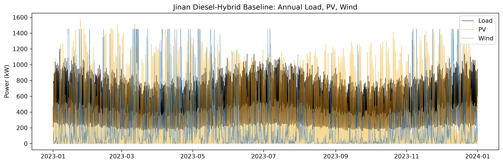
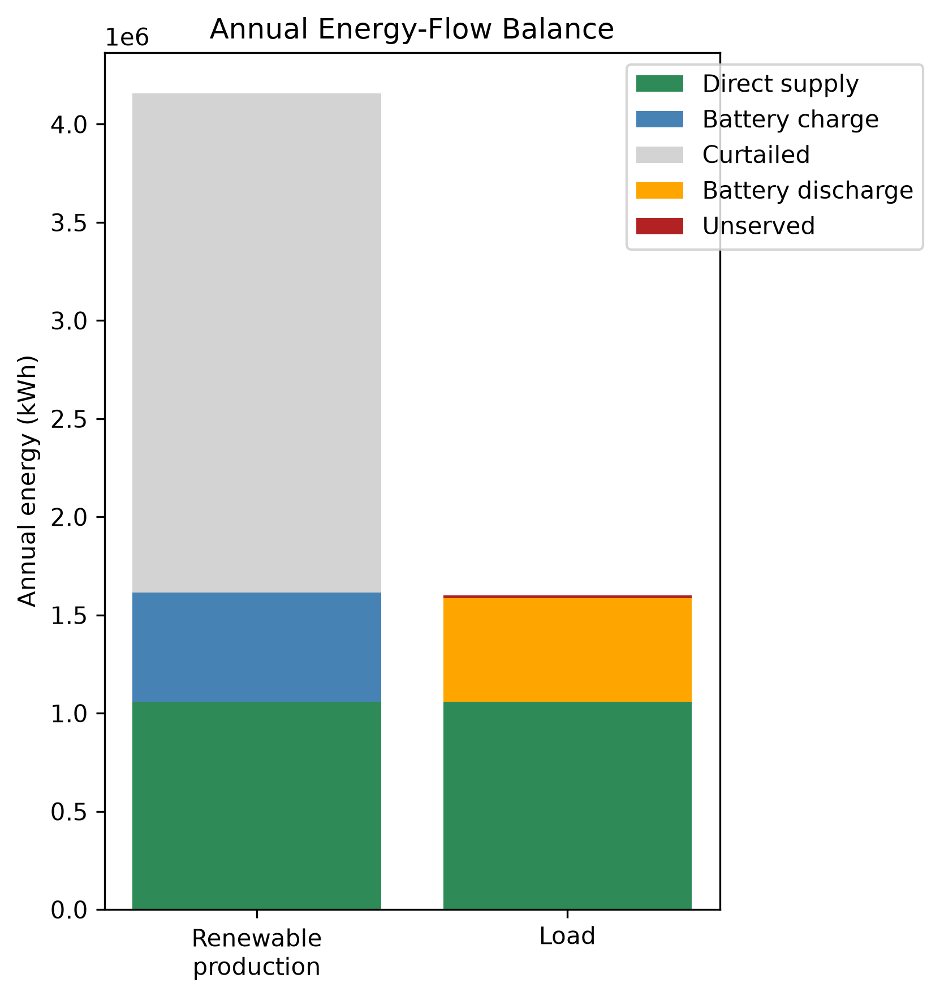
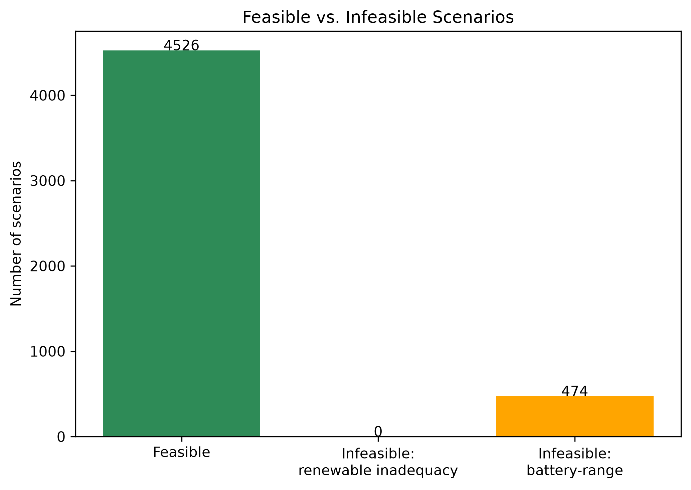
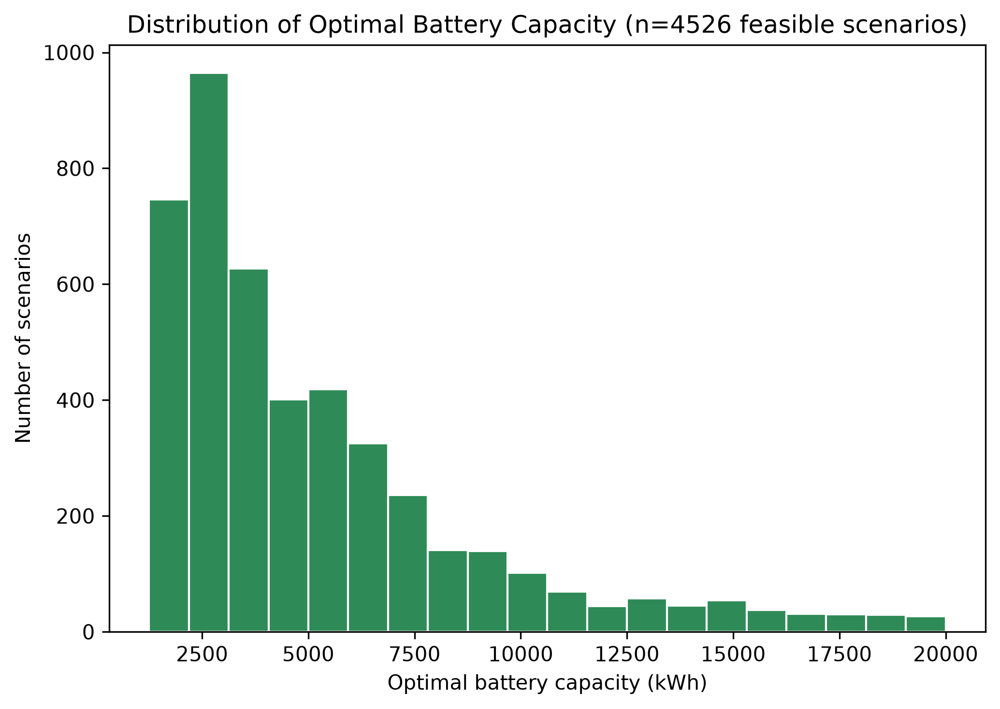
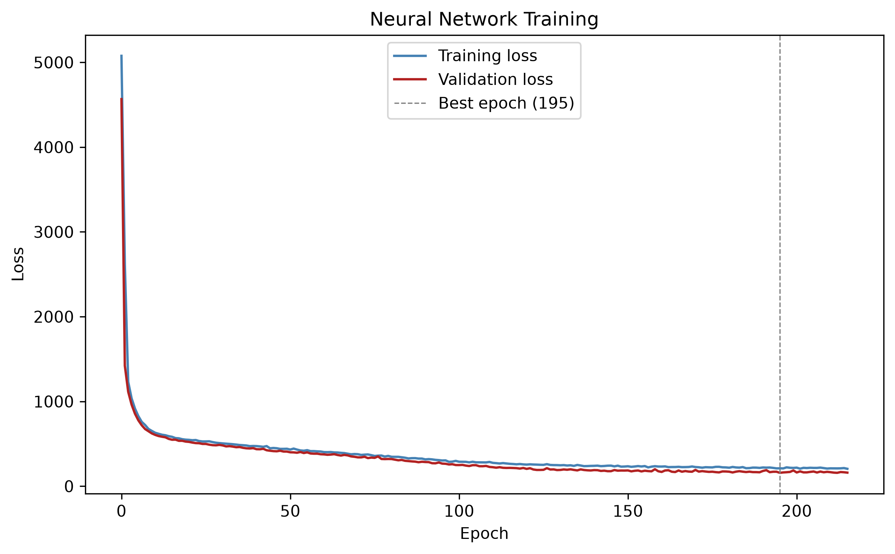
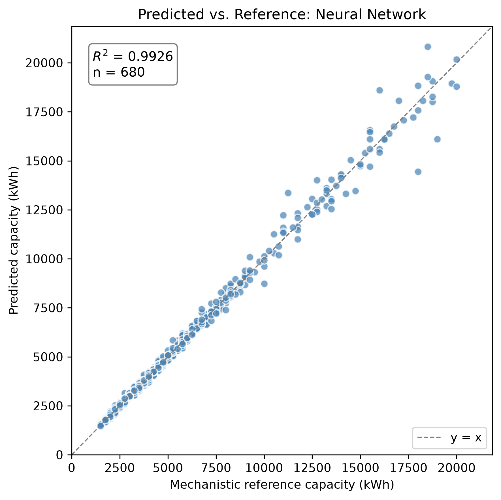
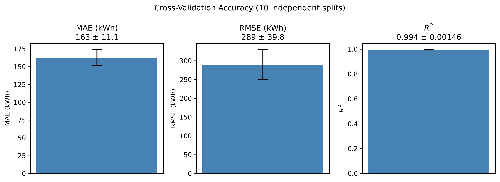
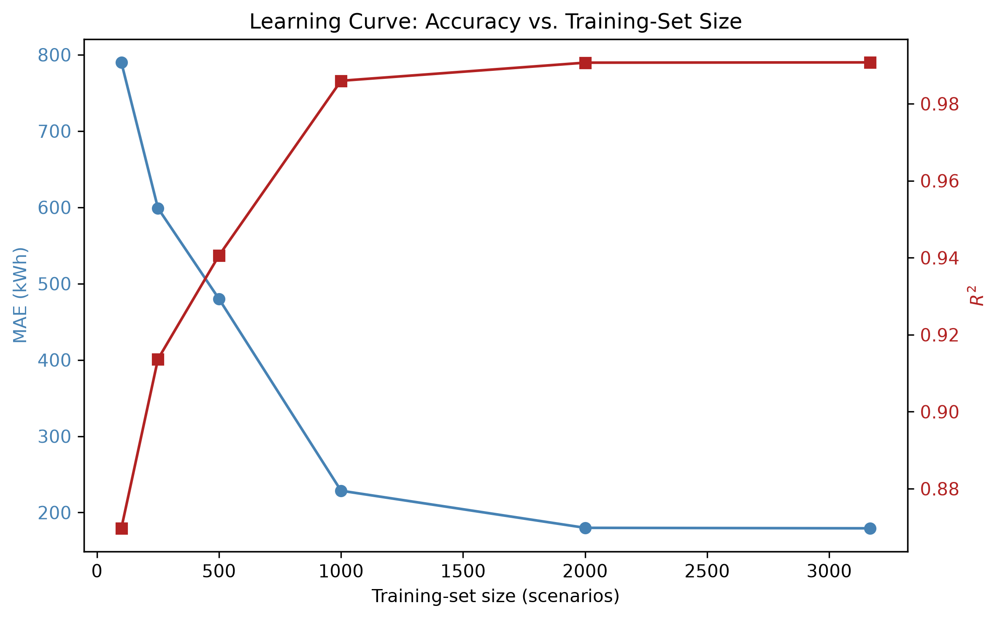
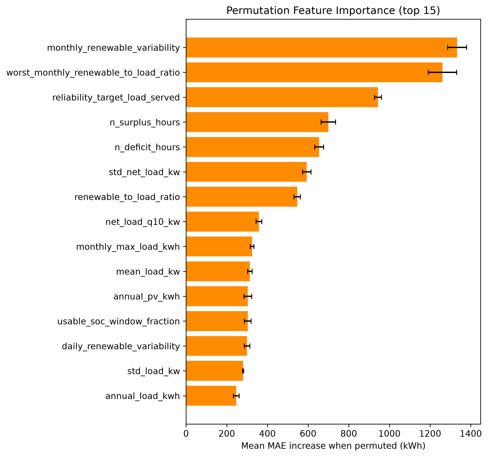
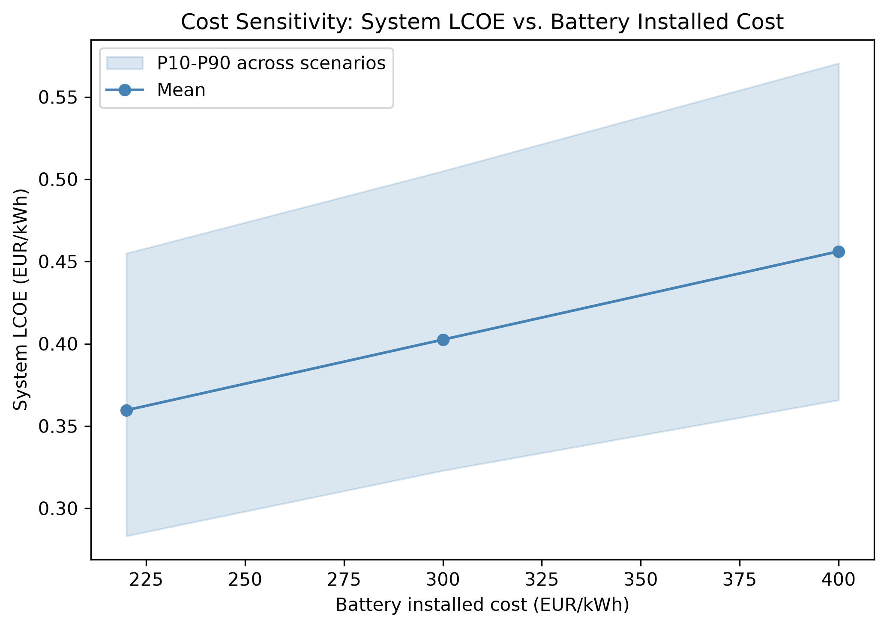

# Battery Sizing: Mechanistic vs. Neural Network Comparison (V2)

## 1. Introduction

This report documents the second iteration ("V2") of a bachelor thesis
project comparing a mechanistic (physics-based) battery-sizing method
against a neural-network method for a hybrid PV + wind + battery power
system. V2 is a from-scratch rebuild of the mechanistic pipeline against a
specific course lecture's exact equations (Campana, *Deploying LLMs for
the Management of Microgrids*, OptiCE slide deck), a narrower and stricter
comparison scope (mechanistic vs. neural network only — no other machine-
learning baselines), and a return to an **off-grid** system configuration
(a hard reliability constraint, no diesel backup), reversing V1's later
diesel-backed pivot. Section 15 details exactly why, and what the
consequence was for the scenario dataset.

Everything in this report is generated from real, executed code against
this project's actual data — no numbers are invented or extrapolated. The
V1 build (documented separately, `reports/` at the repository root)
remains the historical record of the diesel-backed, four-model comparison;
this report supersedes it only in scope (off-grid, NN-only), not in
validity — V1's results still describe V1's own configuration correctly.

## 2. Relationship to V1

V1 completed a full mechanistic-vs-four-ML-model comparison under a
diesel-backed system (battery capacity chosen to minimize system LCOE,
reliability guaranteed near-universally by the diesel generator's power
sizing). An independent engineering review of that build recommended
eleven concrete improvements; V2 implements all of them:

1. Rewrite the mechanistic PV/wind/battery physics to strictly match the
   course lecture's exact equations, with hand-computed reference tests.
2. Remove every ML baseline except the neural network.
3. Resolve, with the thesis author, whether V2 studies a diesel-backed or
   an off-grid system (a checkpoint requiring explicit sign-off — §15).
4. Fix a load-profile-shape coherence gap between the baseline showcase
   and the ML dataset.
5. Add cross-validation error bars to the NN's accuracy claim.
6. Add a learning curve across training-set sizes.
7. Add permutation feature importance.
8. Add a cost-sensitivity analysis.
9. Sharpen the computational-efficiency claim's text.
10. Trim the figure set to a lean, curated set.
11. Regenerate every affected artifact and rewrite this report end-to-end.

Section numbers below map onto this list where relevant.

## 3. Research Objective and Questions

The objective is unchanged from V1: compare a mechanistic battery-sizing
method against a neural-network method, and investigate:

1. How accurately can a neural network reproduce the battery capacities a
   mechanistic optimization would have found, and how stable is that
   accuracy across independent train/test splits (§5, cross-validation)?
2. How does accuracy scale with training-set size (§6, learning curve)?
3. Which scenario characteristics does the model rely on most (§7,
   permutation importance)?
4. Does the AI-selected battery achieve the required reliability when
   verified using hourly mechanistic simulation — a genuine pass/fail
   question again under off-grid, not the near-universal-by-construction
   check V1's diesel-backed system produced (§12)?
5. How sensitive is the system's economics to the battery cost assumption
   (§13)?
6. How much faster is neural-network inference than a complete mechanistic
   battery-size search, precisely stated (§14)?

Research hypothesis, tested rather than assumed: the neural network can
approximate mechanistic battery-sizing outputs closely, at a fraction of
the per-scenario compute cost once trained, but its accuracy and
reliability depend on the representativeness of its training data, and
mechanistic verification remains necessary before trusting any single
prediction. The mechanistic model is the reference method throughout: the
neural network is trained on mechanistic outputs, so its performance is
reported as agreement with that reference, not as validation against real,
metered operational data (which this project does not have access to).

## 4. System Description

**Off-grid configuration** (V2's sole study configuration, `config/
jinan.yaml` → `system.backup: none`): PV + wind generation, battery
storage, and an electrical load, simulated hourly over one complete local
calendar year (8,760 hours, non-leap). No diesel or grid backup exists.
The reliability target (`reliability.primary_lpsp_target`, 1% loss-of-
power-supply-probability) is a **hard constraint**: the mechanistic search
finds the *smallest* battery (by module count, 0–80 modules of 250 kWh
each) that meets it; if no candidate in that range meets it, the scenario
is genuinely infeasible — reported and labelled as such, never silently
replaced by a maximum-battery guess (`src/physics/optimization.py`,
`_select_smallest_feasible`).

This reverses V1's later diesel-backed pivot (Addendum 3 in the shared
`PROJECT_BRIEF.md`), under which diesel — sized by power, always ≥ peak
load — made reliability near-guaranteed for every candidate, and the
objective became minimizing system LCOE instead. Diesel-backed remains
fully supported by the same code (`system_backup="diesel"`) and is V1's
documented, valid prior result; it is not re-run here. §15 explains why
off-grid was chosen for V2.

Site: Jinan, China (36.65°N, 117.12°E), industrial scale (matching V1's
post-completion Addendum 2 pivot). PV 1,800 kWp, wind 1,450 kW (latitude-
tilt fixed array + a single utility-class turbine), baseline annual load
1.6 GWh/year at a 430 kW peak (§15 explains why this differs from V1's 3.8
GWh/year figure).

## 5. Weather and Load Data

Unchanged from V1: NASA POWER's hourly reanalysis product for Jinan, 2023
local calendar year, GHI/DNI/DHI/temperature/wind-speed channels, validated
for unit consistency and completeness (8,760 records, no gaps). The
synthetic residential-shaped load profile generator
(`src.physics.load_profile.generate_load_profile`) is reused unchanged from
V1 — this is *not* real metered data, and is documented as a limitation in
both versions.

## 6. Mechanistic Models: PV, Wind, Battery (Task 1)

Rewritten from scratch against the course lecture's exact equations, with
hand-computed-reference unit tests for every function (`tests/
test_pv_model.py`, `tests/test_wind_model.py`, `tests/
test_energy_balance.py`).

**PV** (`src/physics/pv_model.py`): clearness index and extraterrestrial
irradiance (`k_t = GHI / EGHI`), Erbs decomposition, and Liu & Jordan
isotropic-sky tilted-plane transposition (`GTI = R_b·(GHI−DHI) +
DHI·(1+cos β)/2 + ρ_g·GHI·(1−cos β)/2`) are all implemented and tested
standalone. The main pipeline transposes using NASA POWER's *measured*
DNI/DHI directly via `pvlib.irradiance.get_total_irradiance(model=
"isotropic")` rather than decomposing DHI from GHI via Erbs — verified
numerically to be the *same* Liu & Jordan model, componentwise identical
for the sky-diffuse and ground-reflected terms, differing only in which
measured channel supplies the beam term (measured DNI vs. re-derived
`GHI−DHI`, which are not perfectly consistent in real NASA POWER data —
residuals up to several tens of W/m², an inherent property of
independently-measured irradiance channels, not a bug). NOCT cell
temperature, a linear temperature-derating coefficient, and an incidence-
angle modifier complete the model.

**Wind** (`src/physics/wind_model.py`): power-law height extrapolation
(`v(z) = v(z_r)·(z/z_r)^α`, α = 0.14) and turbine output evaluated by
**linear interpolation on a manufacturer-style power curve**
(`numpy.interp`, matching MATLAB's `interp1`), replacing V1's closed-form
cubic ramp formula. The power-curve table is a discretized (0.5 m/s
resolution) sampling of the same generic cubic-ramp shape used before —
a documented generic curve, not a certified manufacturer curve — so this
change affects the *evaluation mechanism*, not the underlying curve shape.

**Battery** (`src/physics/battery.py`, `src/physics/dispatch.py`): the
lecture's exact SOC state equation, including self-discharge:

    Charging:    E[t] = min(E[t-1]·(1-SDR) + η_c·E_in,t − E_out,t/η_d, E_max)
    Discharging: E[t] = max(E[t-1]·(1-SDR) + η_c·E_in,t − E_out,t/η_d, E_min)

`SDR` (self-discharge rate per hour) is new in V2 — previously omitted
entirely. Set to ≈3.4658×10⁻⁵/hour (a typical LFP value of 2.5%/month,
converted to hourly), it is now active in every scenario, not just
theoretically supported.

## 7. Neural Network Model

Unchanged Keras/TensorFlow MLP architecture from V1 (`config/
ml_training.yaml`): three hidden layers (128/64/32 units, ReLU), 10%
dropout after the first layer, ReLU output (non-negative capacity by
construction), Huber loss, Adam optimizer, early stopping and best-
checkpoint restoration on validation loss. Inputs are 37 engineered
features per scenario (load shape, PV/wind generation statistics, net-
load/deficit statistics, and the scenario's own reliability
target/round-trip efficiency/usable-SOC-window — see `src/ai/features.py`
for the full list); the target is the mechanistic optimal battery capacity
(kWh). Every leakage-prone column (optimal capacity, module count,
reference LPSP/cost/LCOE/renewable share) is excluded from the feature set
and enforced by an automated guard (`LEAKAGE_COLUMNS`, checked on every
feature-matrix build and by `tests/test_features.py`).

**No other ML baselines are used in V2** (Task 2): V1's naive/Ridge/
Random-Forest comparisons are historical V1 results only, not reproduced
here, since the thesis's core comparison is mechanistic vs. neural network.

## 8. Scenario Dataset

5,000 scenarios sampled (`config/scenario_generation.yaml`, PV capacity
500–3,500 kWp, wind 200–2,000 kW, combined cap 5,000 kW, annual load
800,000–2,500,000 kWh/year, peak load 150–550 kW, reliability target
99.0–99.9%, round-trip efficiency 88–97%, usable SOC window 70–90%),
each independently run through the full mechanistic pipeline
(`src.scenarios.scenario_runner.run_scenario`) at Jinan's 2023 weather.
**4,526 of 5,000 (90.5%) are feasible** under off-grid (§15); the
remaining 474 (9.5%) are genuinely infeasible — no battery within the
tested 0–80 module range bridges their renewable/load mismatch — and are
kept honestly labelled with an `infeasibility_reason` string, never
replaced by a maximum-battery guess. Only feasible scenarios have a target
to regress on and are used for NN training/evaluation.

## 9. The Off-Grid Decision and the Sampling-Range Retune (Task 3)

**This was a required checkpoint, not a unilateral choice.** The
engineering review's Task 3 explicitly required confirming with the
thesis author whether V2 should study a diesel-backed system (continuing
V1's Addendum-3 framing) or revert to the original off-grid specification,
because the two configurations test fundamentally different things:
diesel-backed makes reliability near-universal by construction and
verification tests cost-*optimality*; off-grid makes reliability a real
constraint and verification tests genuine pass/fail correctness. That
decision was made explicitly: **off-grid**, on the grounds that it is the
harder, more informative case for a mechanistic-vs-NN comparison — the NN
must learn to respect a real reliability constraint, not just approximate
a cost curve. Diesel-backed stays as V1's valid, documented result.

**The trap, and how it was avoided.** Naively flipping the `system_backup`
config flag to `"none"` under V1's diesel-era sampling ranges (tuned only
for annual energy balance, since diesel-backed never needed a battery
large enough to bridge a full shortfall) reproduced this project's
original, historical finding under off-grid conditions: only **39 of 100**
scenarios were feasible in a direct test, because those ranges allowed
renewable-to-load ratios as low as ~1.1 — too close to parity for any
battery within the tested range to bridge a seasonal shortfall. Generating
the full dataset under those ranges would have collapsed the ML task to
mostly-infeasible labels, telling us little about battery *sizing* and
mostly just re-confirming a known energy-balance limitation.

The sampling ranges were therefore re-tuned — narrowing `annual_load_kwh`
to 800,000–2,500,000 kWh/year and `peak_load_kw` to 150–550 kW, leaving the
PV/wind/combined-capacity ranges untouched — and validated **empirically,
before committing to the full run**: two independent 100-scenario pilots
(different random seeds) under the new ranges showed 88% and 90% feasible
respectively, comfortably above an 80% target while deliberately *not*
pushed toward ~100% — a genuine ~10–12% infeasible tail was kept, so
infeasible labels remain a real, informative minority outcome rather than
an edge case scrubbed away by over-tuning. The full 5,000-scenario run then
confirmed 90.5% feasible (see the feasibility-counts figure in §8),
consistent with both pilots. The
Jinan baseline case (§4) was re-aligned to the same envelope for the same
reason (1.6 GWh/year replaces V1's 3.8 GWh/year, at a renewable/load ratio
of ~2.6, confirmed off-grid-feasible: 20 modules, LPSP 0.94%, 99%
renewable share).

## 10. Load-Profile-Shape Coherence Fix (Task 4)

V1 had an undocumented gap: `config/jinan.yaml`'s baseline showcase used
`profile_family: industrial_baseline`, but every sampled ML scenario
(`src.scenarios.sampling`, `src.ai.features`) always called
`generate_load_profile` *without* a `profile_family` argument — silently
defaulting to `residential_baseline` regardless of the config file's
setting. The Stage-3 baseline "showcase" case therefore never actually
used the same load shape the ML dataset was trained on. V2 fixes this by
setting `profile_family: residential_baseline` explicitly in the config,
so the documented setting matches what every code path has always
actually used.

## 11. Results: Accuracy and Cross-Validation (Task 5)

A single 70/15/15 grouped train/val/test split (seed 42, `scenario_id` as
the group column — a proxy for a plain random split here, since every
scenario is an i.i.d. draw with no near-duplicate family structure to
protect against) gives:

| Metric | Value |
|---|---|
| MAE | 158.8 kWh |
| RMSE | 328.8 kWh |
| R² | 0.9926 |
| Within 10% of reference | 98.2% |
| Within 20% of reference | 100.0% |

The figure above shows predicted vs. mechanistic-reference capacity on the
680-scenario test split, with the 1:1 line and R² annotated directly.

**A single split does not, by itself, establish that this result is
typical rather than a favorable draw.** Ten independent repeated 70/15/15
splits (seeds 0–9, full retraining each time) give:

| Metric | Mean ± Std | Min | Max |
|---|---|---|---|
| MAE (kWh) | 162.7 ± 11.1 | 142.9 | 177.4 |
| RMSE (kWh) | 289.5 ± 39.8 | 218.0 | 335.0 |
| R² | 0.9939 ± 0.0015 | 0.9914 | 0.9961 |

The headline seed-42 result falls squarely within this range: the reported
accuracy is representative, not an outlier.

## 12. Results: Learning Curve (Task 6)

Training-set size was varied from 100 to the full available 3,168-scenario
training split (fixed val/test at seed 42), rather than the suggested
3,500 — this dataset's 4,526 feasible scenarios yield only 3,168 training
rows under a fixed 70/15/15 split, fewer than 5,000 × 0.70 = 3,500; the
last point is honestly capped at what is actually available rather than
forcing an unreachable number.

| Training scenarios | MAE (kWh) | R² |
|---|---|---|
| 100 | 790.1 | 0.870 |
| 250 | 598.9 | 0.914 |
| 500 | 480.0 | 0.941 |
| 1,000 | 228.6 | 0.986 |
| 2,000 | 179.9 | 0.991 |
| 3,168 (full) | 179.3 | 0.991 |

The figure above shows this curve visually: accuracy improves sharply up
to ~1,000 scenarios, then **plateaus** — the jump from 2,000 to the full 3,168
training scenarios buys essentially nothing (179.9 → 179.3 kWh MAE).
Collecting substantially more scenarios beyond ~2,000 would not be an
efficient way to improve this model further; the useful lever for future
work is more informative features or a richer training distribution, not
raw dataset size.

## 13. Results: Permutation Feature Importance (Task 7)

Each of the 37 input features was independently shuffled on the test split
(10 repeats each) and the resulting increase in MAE recorded, using the
already-trained headline model (no retraining). The five most important
features are:

| Feature | Mean MAE increase | % of baseline MAE |
|---|---|---|
| `monthly_renewable_variability` | 1,332.7 kWh | 839% |
| `worst_monthly_renewable_to_load_ratio` | 1,260.5 kWh | 794% |
| `reliability_target_load_served` | 943.7 kWh | 594% |
| `n_surplus_hours` | 699.6 kWh | 440% |
| `n_deficit_hours` | 654.4 kWh | 412% |

This is physically sensible, and reassuring: under an off-grid hard
reliability constraint, the model relies most heavily on exactly the
quantities that should determine how much battery is needed to bridge a
shortfall — how variable renewable generation is month-to-month, how bad
the single worst month's generation/load ratio is, and how strict the
reliability target itself is — rather than on some spurious correlate.

## 14. Results: Physical Verification

Every test-split prediction was rounded up to an installable module count
(never down) and re-simulated through the full hourly mechanistic
dispatch model, exactly as a deployment would have to (`src.ai.
physical_verification`):

| Metric | Value |
|---|---|
| Predictions meeting their own reliability target after rounding | 93.97% |
| Mean extra system LCOE vs. the true optimum | 0.0046 EUR/kWh |
| Within 5% of optimal system LCOE | 96.9% |
| Undersized (predicted < reference) | 6.0% |
| Oversized (predicted > reference) | 52.9% |

Unlike V1's diesel-backed system — where reliability was near-guaranteed
by construction and physical verification's headline question became
"how much extra does trusting the AI cost" — off-grid reliability is a
**real, non-trivial pass/fail question again**: 6.0% of test predictions
underestimate the required capacity by enough that, even after rounding up
to the nearest 250 kWh module, the resulting system misses its own
reliability target. This is the direct, honest answer to Research Question
4 (§3): the neural network's rounded predictions do *not* achieve the
required reliability in every case, and mechanistic re-verification before
deployment remains necessary, exactly as the tested hypothesis anticipated.

## 15. Results: Cost Sensitivity (Task 8)

Battery installed cost was swept across the project's own documented
sensitivity range (`config/jinan.yaml battery.cost_sensitivity_eur_per_kwh:
[220, 300, 400]` EUR/kWh, baseline 300) across all 4,526 feasible
scenarios, closed-form (PV/wind/battery capital+O&M cost are pure
functions of capacity and configuration, independent of the hourly
dispatch — a sanity-check assertion confirms this reconstruction exactly
recovers the stored baseline system LCOE before trusting the swept points):

| Battery cost (EUR/kWh) | Mean system LCOE (EUR/kWh) | Battery share of total cost |
|---|---|---|
| 220 | 0.360 | 33.1% |
| 300 (baseline) | 0.403 | 39.2% |
| 400 | 0.456 | 45.3% |

The figure above shows the full distribution (P10–P90 band). Battery cost
drives roughly a third to nearly half of total system cost across this range —
a materially significant, but not dominant, share; PV and wind capital
cost make up the remainder. **Diesel price sensitivity, the brief's other
suggested leg, does not apply to V2's off-grid study** — diesel's rated
power is exactly 0 kW for every V2 scenario, so no diesel cost assumption
can affect anything here. That sensitivity remains meaningful only for
V1's diesel-backed configuration, where it was not separately explored
either (a genuine limitation of both versions, noted rather than glossed
over).

## 16. Computational Efficiency, Precisely Stated (Task 9)

V1's efficiency claim ("neural-network inference is much faster than a
complete mechanistic search") is true but was previously stated loosely.
Measured directly on this project's own hardware:

- **Mechanistic optimization** (searching all 0–80 candidate battery
  sizes, each requiring a full 8,760-hour dispatch simulation): **0.377
  seconds per scenario on average** (5,000-scenario dataset, median 0.370s,
  range 0.310–2.641s).
- **Neural-network inference, batched** (predicting all 680 test-split
  scenarios in one call — the realistic regime for evaluating many
  candidate scenarios at once): **0.15 milliseconds per scenario**, roughly
  **2,500× faster** than the mechanistic search, per scenario.
- **Neural-network inference, single scenario at a time** (one ad-hoc
  query, e.g. an interactive tool evaluating one design at a time):
  **~58 milliseconds**, dominated by per-call framework overhead rather
  than the arithmetic itself — still **~6.5× faster** than the mechanistic
  search, but nowhere near the batched figure.

The precise, honest claim is therefore: **the neural network's efficiency
advantage is real but regime-dependent** — it is dramatic (~2,500×) when
many scenarios are evaluated together, and much more modest (~6.5×) for
one-off single predictions, because a large fraction of the single-call
latency is fixed per-call overhead rather than genuine computation. This
advantage also excludes the NN's own one-time training cost (a few minutes
per training run, §11–§12), which the mechanistic method does not incur at
all — the NN is only "free" per new scenario *after* that upfront
investment, and only pays off if many scenarios need evaluating.

## 17. Discussion and Limitations

- The load profile remains a synthetic, parametrically-shaped generator,
  not real metered data (unchanged limitation from V1).
- The wind power curve remains a generic normalized shape, not a specific
  manufacturer's certified curve.
- The scenario dataset is single-location, single-weather-year (Jinan,
  2023); geographic transfer and unseen-weather-year holdout (V1's
  Experiments B/C) remain unattempted stretch goals in V2 as well.
- The learning curve (§12) shows this model is not data-starved at its
  current scale — the plateau past ~2,000 scenarios suggests further
  gains would need better features or a wider training distribution, not
  simply more scenarios of the same kind.
- Permutation importance (§13) measures the *trained* model's sensitivity,
  not a causal claim about which physical quantities matter in general.
- Diesel-price cost sensitivity is not explored in either V1 or V2 (§15).
- Off-grid physical verification (§14) shows a genuine ~6% undersizing-
  driven reliability-violation rate on the test split — a real risk any
  deployment of this model would need to guard against (e.g. by always
  rounding up with a safety margin, or by treating the NN's prediction as
  advisory pending mechanistic confirmation), not a solved problem.

## 18. Conclusion

Under V2's off-grid configuration, with a mechanistic model rewritten to
strictly match the course lecture's exact equations, the neural network
reproduces mechanistic battery-sizing decisions closely (R² = 0.993 ±
0.002 across ten independent splits) and does so at a genuine, precisely-
quantified computational advantage over the full mechanistic search —
dramatic when evaluating many scenarios at once, more modest for one-off
queries. That accuracy is not free of risk: physical re-verification
catches a real ~6% reliability-violation rate among rounded NN
predictions, confirming the tested hypothesis that mechanistic
verification remains necessary rather than optional. The learning curve
indicates the model is well past the point of diminishing returns from
more data at its current scale, and permutation importance confirms it
has learned physically sensible relationships rather than spurious
correlations. Battery cost materially affects system economics
(33–45% of total system cost across a realistic price range) without
changing which battery size is selected, since off-grid sizing is driven
by the reliability constraint alone, not cost.
