# Battery Sizing for a Diesel-Hybrid System: Mechanistic vs. Neural Network Comparison

## 1. Introduction

This report compares a mechanistic (physics-based) battery-sizing method
against a neural-network method for a hybrid PV + wind + battery + diesel
power system. The system studied throughout is a **diesel-hybrid**
microgrid: renewable generation and battery storage serve as much load as
possible, and a diesel generator — sized by power so it can always cover
peak demand — makes up the rest. Battery capacity is chosen to minimize
total system levelized cost of electricity (LCOE), not to satisfy a hard
reliability constraint; with diesel present, reliability is effectively
guaranteed by construction, so the interesting question shifts from "does
the battery keep the lights on" to "how much battery is actually worth
paying for, and how well can a neural network learn that economic
trade-off."

Everything in this report is generated from real, executed code against
this project's actual data; no numbers are invented or extrapolated. A
short qualitative note on a diesel-free (off-grid) version of this system
appears in the discussion (§16) as motivation for keeping diesel in the
design — it is not presented as a second study with its own results.

## 2. Research Objective and Questions

The objective is to compare a mechanistic battery-sizing method against a
neural-network method for this diesel-hybrid system, and to answer:

1. How accurately can a neural network reproduce the battery capacities a
   mechanistic cost-minimization would have found, and how stable is that
   accuracy across independent train/test splits (§9, cross-validation)?
2. How does accuracy scale with training-set size (§10, learning curve)?
3. Which scenario characteristics does the model rely on most, and how
   much better is it than a simple baseline using only the strongest of
   those characteristics (§11–§12, permutation importance and a
   linear-regression baseline)?
4. Diesel makes a hard reliability failure essentially impossible by
   construction, so the question is no longer "does the AI's battery meet
   the reliability target" — it is **how much does trusting the AI's
   predicted battery cost economically, compared to the true
   cost-minimizing choice, and how much more does it lean on the diesel
   generator than the optimum would** (§13)?
5. How sensitive is the optimal battery size itself to the battery cost
   assumption (§14)?
6. How much faster is neural-network inference than a complete
   mechanistic battery-size search, precisely stated (§15)?

Research hypothesis, tested rather than assumed: the neural network can
approximate mechanistic battery-sizing outputs closely, at a fraction of
the per-scenario compute cost once trained, but its accuracy depends on
the representativeness of its training data, and mechanistic verification
remains useful before trusting any single prediction — even though, unlike
a hard-reliability system, a diesel-hybrid system's downside from trusting
a slightly-wrong prediction is economic (a somewhat higher system cost,
somewhat more diesel use) rather than a service failure. The mechanistic
model is the reference method throughout: the neural network is trained on
mechanistic outputs, so its performance is reported as agreement with that
reference, not as validation against real, metered operational data (which
this project does not have access to).

## 3. System Description

PV + wind generation, battery storage, a diesel generator, and an
electrical load, simulated hourly over one complete local calendar year
(8,760 hours, non-leap). Dispatch priority: renewable generation serves
load directly first; surplus renewable energy charges the battery (any
further surplus is curtailed); when renewables alone cannot cover load,
the battery discharges to cover the shortfall; any load still unmet after
the battery is covered by the diesel generator, up to its rated power.

The diesel generator is sized by power, not chosen by the optimization: its
rated output is fixed at 1.25× the load's achieved peak demand for every
scenario, which is enough to cover the full system peak on its own if
necessary. Because of this, loss-of-power-supply probability (LPSP) is
effectively zero for every candidate battery size — the battery's role is
not to guarantee reliability but to reduce how much energy the diesel
generator has to supply, and therefore how much is spent on both battery
capital cost and diesel fuel together. The mechanistic search evaluates
battery sizes from 0 to 80 modules (250 kWh each) and selects the one that
minimizes total system LCOE, not the smallest one that meets a reliability
target.

Site: Jinan, China (36.65°N, 117.12°E), industrial scale. PV 1,800 kWp,
wind 1,450 kW (latitude-tilt fixed array + a single utility-class
turbine), baseline annual load 4.5 GWh/year at a 1,200 kW peak (achieved
peak ≈1,199 kW) — sized so renewable generation and load are close enough
in magnitude for the diesel generator to meaningfully engage rather than
sit idle (§8 shows the sensitivity of this choice).

## 4. Weather and Load Data

NASA POWER's hourly reanalysis product for Jinan, 2023 local calendar
year, GHI/DNI/DHI/temperature/wind-speed channels, validated for unit
consistency and completeness (8,760 records, no gaps). The load profile is
generated by a synthetic residential-shaped load-profile model
(`generate_load_profile`) scaled to the target annual energy and peak
demand — this is not real metered data, and is documented as a limitation
in §16.

## 5. Mechanistic Models: PV, Wind, Battery, Diesel

Every physics function below has hand-computed-reference unit tests.

**PV**: clearness index and extraterrestrial irradiance (`k_t = GHI /
EGHI`), Erbs decomposition, and Liu & Jordan isotropic-sky tilted-plane
transposition (`GTI = R_b·(GHI−DHI) + DHI·(1+cos β)/2 + ρ_g·GHI·(1−cos
β)/2`). The main pipeline transposes using NASA POWER's measured DNI/DHI
directly rather than decomposing DHI from GHI, verified numerically to be
componentwise identical to the Erbs-based path for the diffuse and
ground-reflected terms. NOCT cell temperature, a linear
temperature-derating coefficient, and an incidence-angle modifier complete
the model.

**Wind**: power-law height extrapolation (`v(z) = v(z_r)·(z/z_r)^α`,
α = 0.14) and turbine output evaluated by linear interpolation on a
discretized manufacturer-style power curve (a documented generic cubic-ramp
shape, not a certified manufacturer curve).

**Battery**: the state-of-charge equation, including hourly self-discharge:

    Charging:    E[t] = min(E[t-1]·(1-SDR) + η_c·E_in,t − E_out,t/η_d, E_max)
    Discharging: E[t] = max(E[t-1]·(1-SDR) + η_c·E_in,t − E_out,t/η_d, E_min)

`SDR` (self-discharge rate per hour) is set to ≈3.4658×10⁻⁵/hour (a
typical LFP value of 2.5%/month, converted to hourly).

**Diesel**: rated power fixed at 1.25× the scenario's achieved peak load;
fuel consumption follows a standard linear fuel curve (`F(P) = F0·P_rated +
F1·P_output`) with widely-cited default coefficients; fuel is priced at
0.90 EUR/L. Capital and O&M costs are annualized alongside PV, wind, and
battery costs to compute total system LCOE.

## 6. Neural Network Model

A Keras/TensorFlow MLP: three hidden layers (128/64/32 units, ReLU), 10%
dropout after the first layer, ReLU output (non-negative capacity by
construction), Huber loss, Adam optimizer, early stopping and
best-checkpoint restoration on validation loss. Inputs are 37 engineered
features per scenario (load shape, PV/wind generation statistics, net-load
and deficit/surplus statistics, and the scenario's own reliability
target/round-trip efficiency/usable-SOC-window); the target is the
mechanistic cost-minimizing battery capacity (kWh). Every leakage-prone
column (optimal capacity, module count, reference LPSP/cost/LCOE/renewable
share) is excluded from the feature set and enforced by an automated
guard, checked on every feature-matrix build.

A simple linear-regression baseline using only the three most important
features (identified by permutation importance, §11) is also evaluated for
comparison (§12), to establish how much of the neural network's accuracy
comes from its top few inputs alone versus genuinely combining all 37.

## 7. Scenario Dataset

5,000 scenarios were sampled (PV capacity 500–3,500 kWp, wind 200–2,000
kW, combined PV+wind cap 5,000 kW, annual load 1.5–6.5 GWh/year, peak load
400–1,800 kW, reliability target 99.0–99.9%, round-trip efficiency
88–97%, usable SOC window 70–90%), each independently run through the full
mechanistic pipeline at Jinan's 2023 weather. Because the diesel generator
can always cover any remaining shortfall, **every one of the 5,000
scenarios (100%) is feasible** — unlike a hard-reliability system, there is
no scenario a battery-plus-diesel combination cannot serve; the only
question is how much battery is worth installing to minimize cost. The
reliability target and round-trip efficiency remain sampled per scenario
and used as model inputs, since they still affect how much the battery can
usefully contribute, even though neither is a binding feasibility
constraint here.

The resulting cost-minimizing battery size varies meaningfully across the
dataset — mean 18.1 modules (4,522 kWh), standard deviation 8.5 modules,
ranging from 0 (renewable-poor or load-heavy scenarios where diesel alone
is cheapest) to 46 modules. This spread matters: because battery cost
genuinely changes which size is optimal here (§14), the neural network's
target is a real economic trade-off, not (as in a hard-reliability system)
a value driven purely by a fixed constraint regardless of cost.

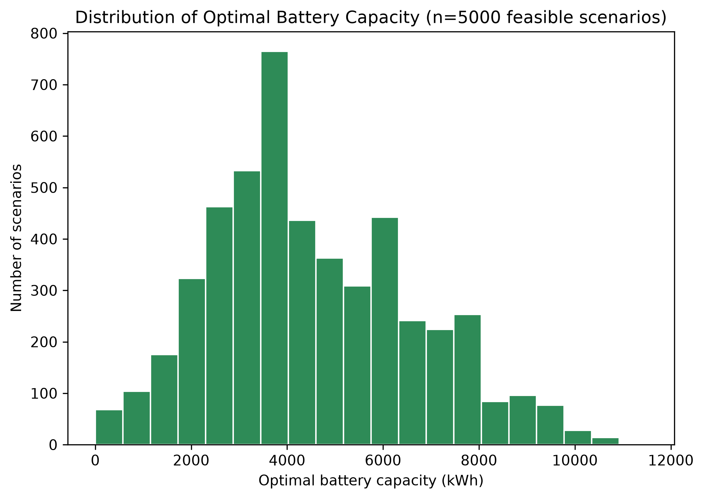

## 8. Baseline System: Diesel Engagement and the Renewable-Share/LCOE Trade-off

At the baseline case (§3), the mechanistic search's cost-minimizing choice
is:

| Metric | Value |
|---|---|
| Optimal battery | 24 modules · 6,000 kWh |
| System LCOE at optimum | 0.288 EUR/kWh |
| Renewable share / diesel share | 74.1% / 25.9% |
| Curtailment (of generated renewable energy) | 18.4% |
| Diesel operating hours | 3,250 / 8,760 (37.1% of the year) |
| Diesel fuel consumption | 683,550 L/year |
| Diesel capacity factor | 8.87% |
| LPSP | 0.0 (diesel guarantees reliability by construction) |

The baseline load and peak (§3) were chosen deliberately so the diesel
generator visibly participates rather than sitting idle: at a lower load
relative to the fixed PV/wind capacity, renewable generation alone would
cover the great majority of demand and diesel would barely run; at a
higher load, diesel would dominate. 4.5 GWh/year at 1,200 kW peak lands in
a middle range where both technologies do real, comparable work.

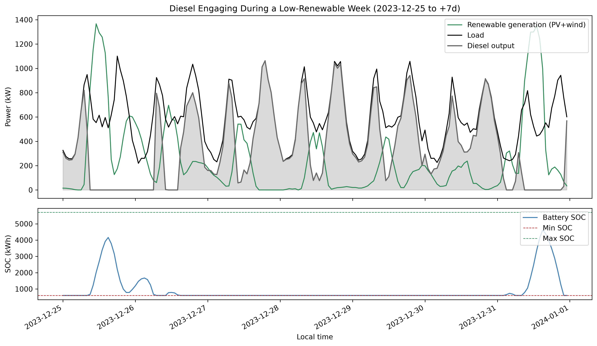

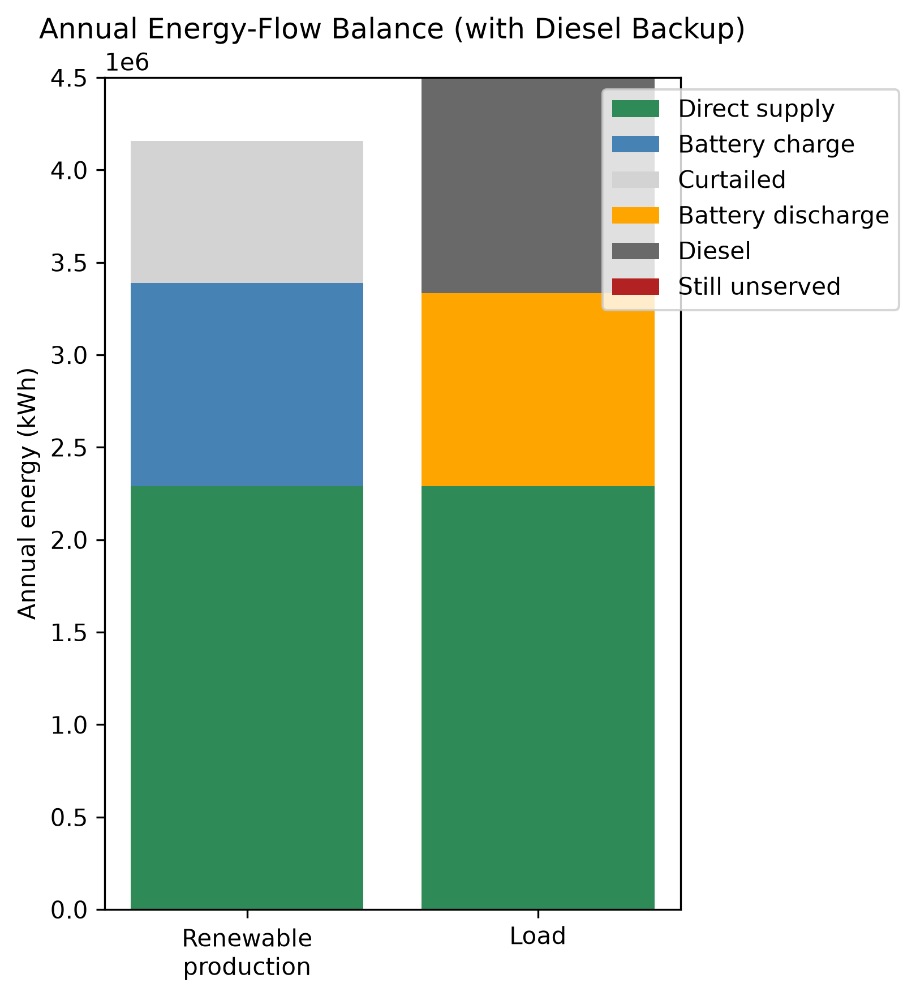

Energy balance is verified exactly every hour of the year: `load_kw` =
`direct_supply_kwh` + `battery_discharge_kwh` + `diesel_output_kwh` +
`still_unserved_kwh`, annual residual 0.0 kWh.

**Where does more battery stop paying for itself?** Sweeping the full
0–80-module candidate range at the baseline case traces a clean U-shaped
(backward-bending) renewable-share-vs-LCOE curve:

| Point | Modules | Battery capacity | System LCOE | Renewable share |
|---|---|---|---|---|
| Diesel-only (no battery) | 0 | 0 kWh | 0.346 EUR/kWh | 50.9% |
| **Cost-minimizing (the search's own optimum)** | **24** | **6,000 kWh** | **0.288 EUR/kWh** | **74.1%** |
| Maximum tested battery | 80 | 20,000 kWh | 0.374 EUR/kWh | 80.4% |

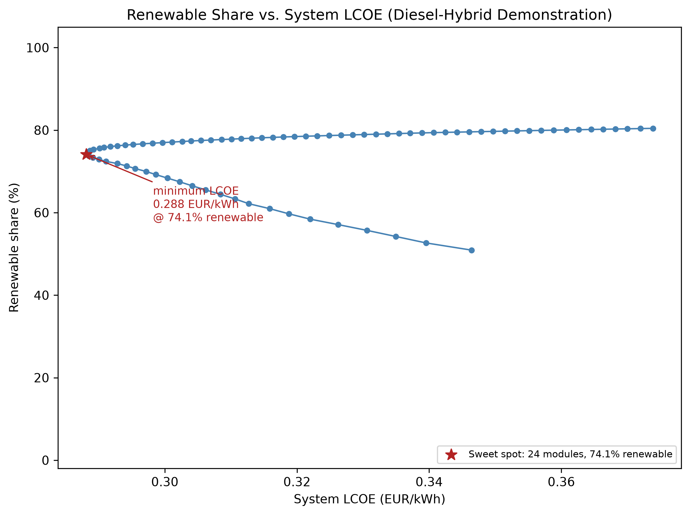

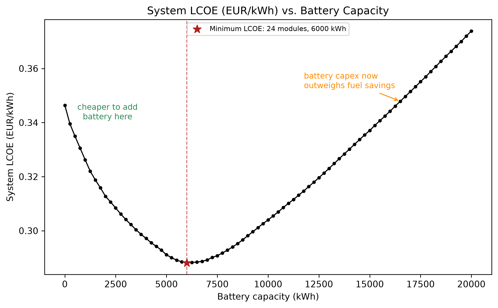

Starting from diesel-only, each added battery module saves more in diesel
fuel than it costs in capital — system LCOE falls 17% (0.346 → 0.288
EUR/kWh) as renewable share climbs from 50.9% to 74.1%. Past 24 modules,
the relationship flips: each additional module's capital cost now exceeds
what it saves in fuel, because the marginal battery capacity is mostly
covering rarer, higher-deficit hours rather than displacing routine diesel
runtime. Pushing all the way to the 80-module cap buys only another 6.3
percentage points of renewable share (74.1% → 80.4%) but costs 30% more
(0.374 EUR/kWh) than the optimum.

**Renewable share is worth paying for up to ~74% at this baseline case;
beyond that, each additional percentage point of renewable share costs
markedly more per kWh delivered.** This is the economic sweet spot the
neural network is ultimately being asked to learn to predict, scenario by
scenario, across the full sampled dataset.

## 9. Results: Accuracy and Cross-Validation

A single 70/15/15 grouped train/val/test split (seed 42, `scenario_id` as
the group column — a proxy for a plain random split, since every scenario
is an i.i.d. draw) gives, on the 751-scenario test split:

| Metric | Value |
|---|---|
| MAE | 125.9 kWh |
| RMSE | 168.2 kWh |
| R² | 0.9934 |
| Within 5% of reference | 79.0% |
| Within 10% of reference | 93.9% |
| Within 20% of reference | 98.9% |

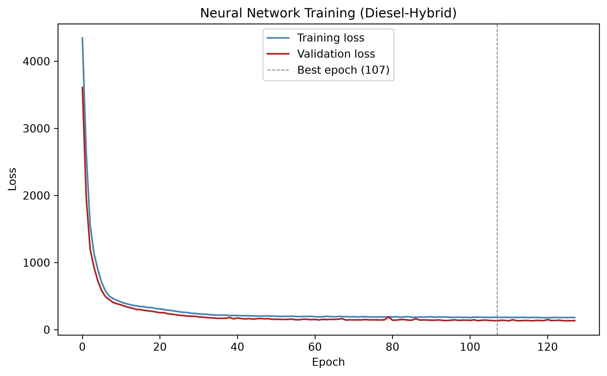

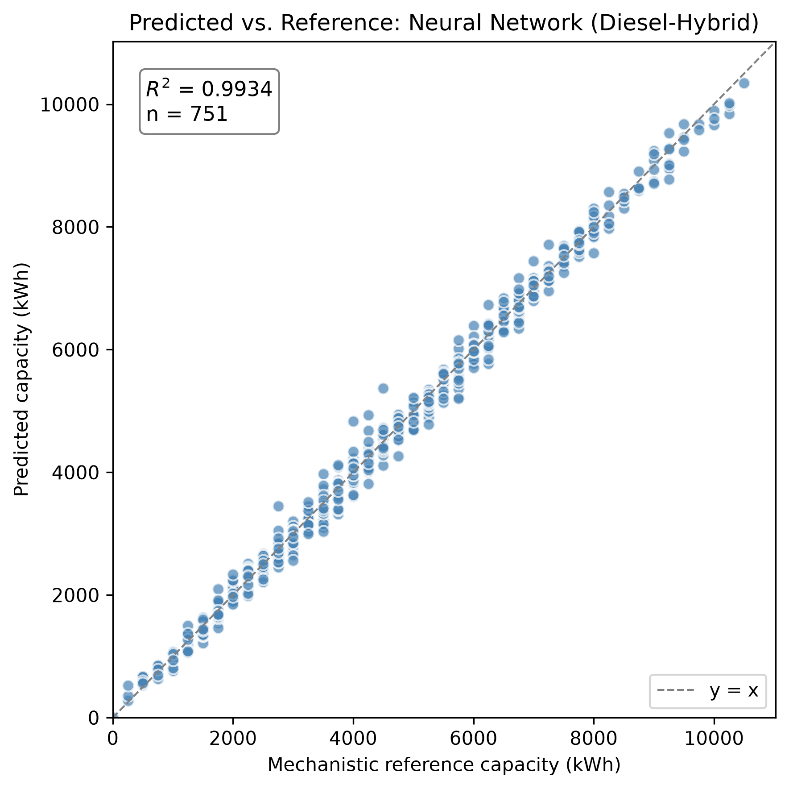

**A single split does not, by itself, establish that this result is
typical rather than a favorable draw.** Ten independent repeated 70/15/15
splits (seeds 0–9, full retraining each time) give:

| Metric | Mean ± Std | Min | Max |
|---|---|---|---|
| MAE (kWh) | 123.9 ± 5.2 | 116.0 | 134.3 |
| RMSE (kWh) | 165.5 ± 5.1 | 158.6 | 175.4 |
| R² | 0.9939 ± 0.0004 | 0.9931 | 0.9944 |

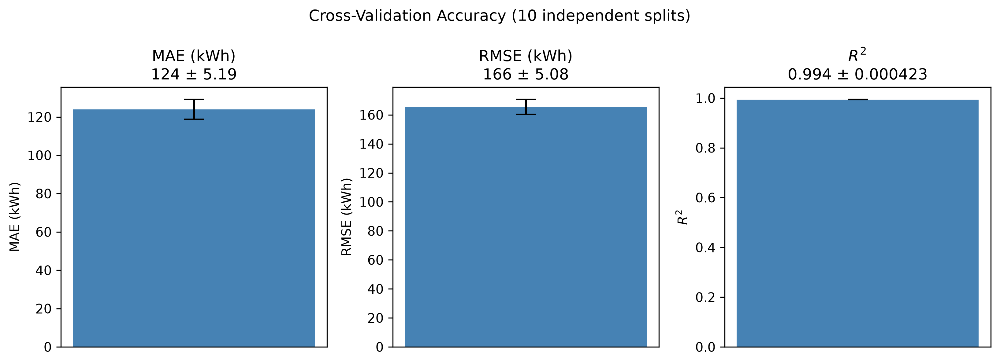

The headline seed-42 result falls squarely within this range: the reported
accuracy is representative, not an outlier, and is in fact tighter
(smaller standard deviation) than the equivalent cross-validated accuracy
this project previously observed under a hard-reliability target — even
though the diesel-hybrid target is a genuinely cost-dependent quantity
rather than one driven by a fixed constraint.

## 10. Results: Learning Curve

Training-set size was varied from 100 to the full available 3,500-scenario
training split (fixed val/test at seed 42):

| Training scenarios | MAE (kWh) | R² |
|---|---|---|
| 100 | 588.3 | 0.848 |
| 250 | 254.2 | 0.965 |
| 500 | 173.9 | 0.986 |
| 1,000 | 141.1 | 0.991 |
| 2,000 | 130.5 | 0.993 |
| 3,500 (full) | 111.5 | 0.995 |

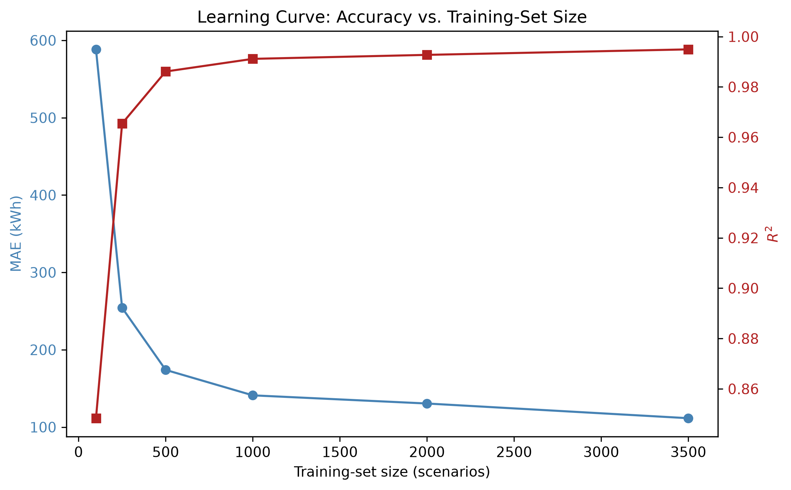

Accuracy improves sharply up to ~1,000 scenarios, then continues to
improve more gradually rather than fully plateauing — the full 3,500-
scenario training set still meaningfully outperforms the 2,000-scenario
point (130.5 → 111.5 kWh MAE), unlike the flatter plateau this project
observed for a hard-reliability target at a similar scale. This is
consistent with the target itself being a more complex, genuinely
cost-dependent function of the scenario inputs here: there is more signal
left for additional training data to capture.

## 11. Results: Permutation Feature Importance

Each of the 37 input features was independently shuffled on the test split
(10 repeats each) and the resulting increase in MAE recorded, using the
already-trained headline model (baseline test MAE 125.9 kWh, no
retraining). The five most important features are:

| Feature | Mean MAE increase | % of baseline MAE |
|---|---|---|
| `renewable_to_load_ratio` | 1,870.6 kWh | 1,485% |
| `worst_monthly_renewable_to_load_ratio` | 1,648.8 kWh | 1,309% |
| `n_deficit_hours` | 1,440.6 kWh | 1,144% |
| `n_surplus_hours` | 1,400.3 kWh | 1,112% |
| `total_deficit_energy_kwh` | 1,339.5 kWh | 1,064% |

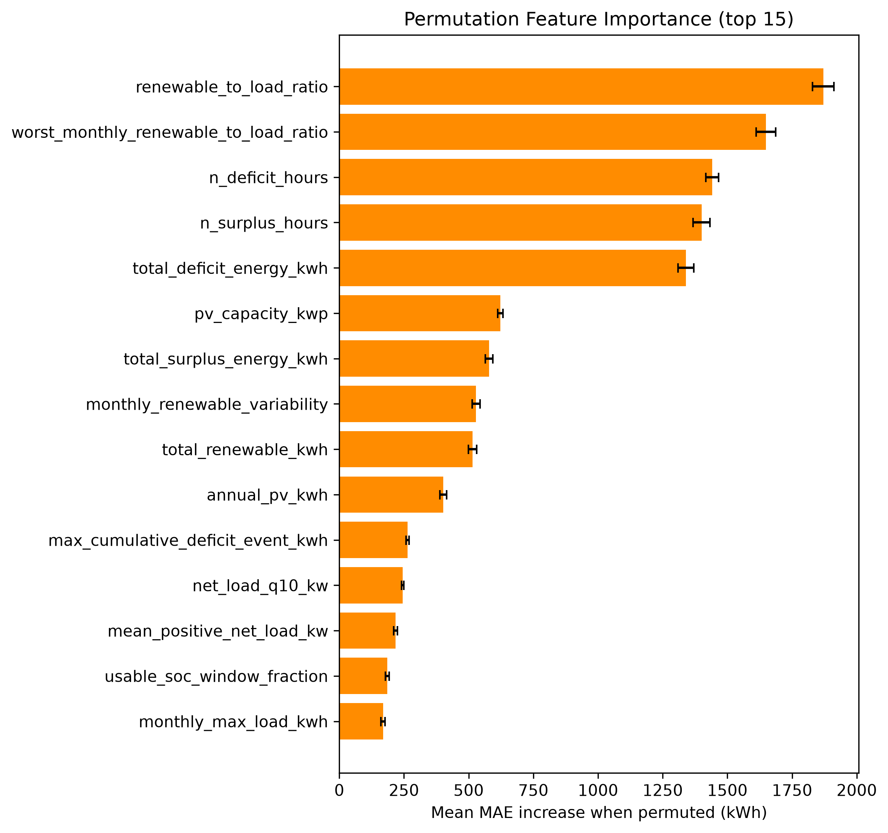

This is physically sensible: under a cost-minimization objective with
diesel available, the model relies most heavily on how much renewable
generation there is relative to load overall and in the worst month, and
on how often and how severely renewables fall short of covering demand —
exactly the quantities that determine the trade-off between battery
capital cost and diesel fuel savings. This differs from what mattered most
under a hard-reliability target (where the strictness of the reliability
requirement itself ranked highly); here, the *economics* of covering
deficits, not a pass/fail threshold, drives the ranking.

## 12. Results: Simple Baseline Comparison

To check how much of the neural network's accuracy comes from combining
all 37 features versus relying mostly on the top few, a linear-regression
model was fit using only the three most important features from §11
(`renewable_to_load_ratio`, `worst_monthly_renewable_to_load_ratio`,
`n_deficit_hours`), on the same train/test split:

| Model | MAE (kWh) | R² | Within 10% of reference |
|---|---|---|---|
| Linear regression, top 3 features | 1,205.1 | 0.453 | 21.8% |
| Neural network, all 37 features | 125.9 | 0.993 | 93.9% |

The full neural network's MAE is roughly ten times lower than the simple
baseline's, and its R² is more than double. Even though the top few
features dominate the permutation-importance ranking, a linear combination
of just those three captures less than half the target's variance — the
neural network's ability to combine all 37 features, including their
non-linear interactions, accounts for the great majority of its accuracy
advantage. This confirms the model is not simply reproducing what a much
simpler method could already achieve from the most obviously important
inputs.

## 13. Results: Physical Verification — Economic Cost and Reliance on Diesel

Every test-split prediction was rounded up to an installable module count
(never down) and re-simulated through the full hourly mechanistic dispatch
model, exactly as a deployment would have to:

| Metric | Value |
|---|---|
| Mean extra system LCOE vs. the true cost-minimizing choice | 0.00013 EUR/kWh |
| Within 5% of the optimal system LCOE | 100.0% |
| Undersized (predicted < reference) | 6.9% |
| Oversized (predicted > reference) | 41.4% |
| Mean excess capacity when oversized | 96.9 kWh |
| Worst-case underprediction | 500 kWh (two modules) |

Because diesel guarantees reliability by construction, 100% of rounded
predictions technically satisfy the scenario's own reliability target —
this is no longer a meaningful pass/fail test (it is guaranteed for
essentially any battery size, including zero), so the economic and
diesel-reliance measures below are the informative ones instead.

**Economic cost of trusting the AI.** Rounding the AI's prediction up and
installing it, instead of the true cost-minimizing battery size, raises
system LCOE by an average of only 0.00013 EUR/kWh — a small fraction of a
percent of the baseline system's 0.288 EUR/kWh — and every single
test-split prediction lands within 5% of the true optimal system LCOE.
Trusting the neural network's rounded prediction directly, without
mechanistic re-verification, costs almost nothing economically in this
system, in sharp contrast to a hard-reliability system where an
undersized prediction can cause an outright service failure.

**How much more does the AI's choice lean on diesel than the optimum
would?** For each scenario, the loss-of-power-supply probability that
renewables and battery *alone* (without diesel) would achieve was computed
for both the AI's installed capacity and the true optimal capacity — a
direct measure of how much each choice would need to lean on diesel if it
had to. Averaged across the test split:

| Metric | Value |
|---|---|
| Mean battery-alone LPSP, AI's installed capacity | 19.8% |
| Mean battery-alone LPSP, true optimal capacity | 20.0% |
| Mean difference (AI minus optimum) | -0.2 percentage points |
| Scenarios where the AI leans *more* on diesel than the optimum would | 6.9% |

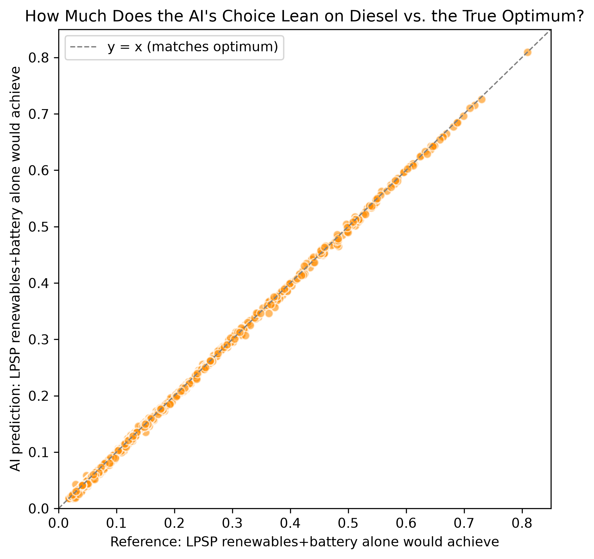

On average, the AI's rounded battery choice leans on diesel very slightly
*less* than the true optimum would (a difference of -0.2 percentage points
— within noise of zero), and only 6.9% of test-split scenarios — closely
matching the 6.9% that were undersized — see the AI leaning more heavily
on diesel than the optimal choice would have. This is the direct answer to
Research Question 4 (§2): trusting the AI's prediction costs almost
nothing economically and shifts reliance onto diesel only in the minority
of cases where the prediction undershoots the true optimum, and even then
by a modest amount, not a large one.

## 14. Results: Cost Sensitivity

Unlike a hard-reliability system — where battery cost changes the
*reported* system LCOE but never which battery size gets selected, since
sizing there is driven purely by a reliability constraint — under
cost-minimization with diesel available, the optimal battery genuinely
depends on the battery cost assumption: a cheaper battery can profitably
displace more diesel fuel, so the optimum grows; a more expensive battery
displaces less, so the optimum shrinks toward diesel-only. Battery
installed cost was swept across the project's documented sensitivity range
(220, 300, 400 EUR/kWh, baseline 300) on a 1,000-scenario random subsample,
re-running the full mechanistic search at each cost point since the
selected candidate itself changes, not just its reported economics:

| Battery cost (EUR/kWh) | Mean optimal battery (modules) | Std | Median |
|---|---|---|---|
| 220 | 20.2 | 8.6 | 19 |
| 300 (baseline) | 18.1 | 8.4 | 16 |
| 400 | 15.9 | 8.3 | 15 |

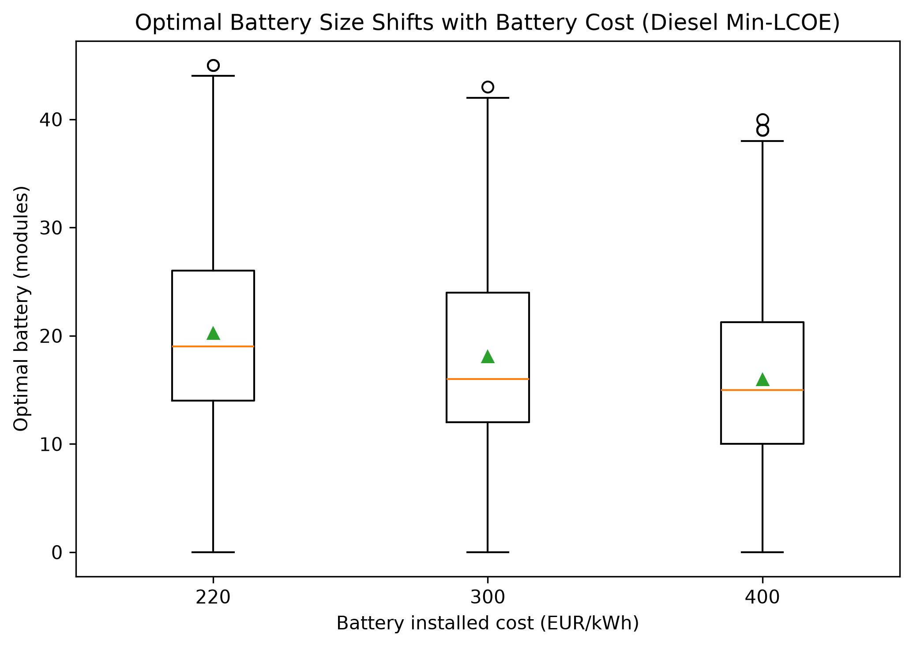

The shift is monotonic and consistent across the full distribution, not
just at the mean: the cheaper the battery, the larger the cost-minimizing
system chooses to build, because it becomes worthwhile to displace
progressively more diesel fuel with capital investment. This confirms that
the neural network trained at the 300 EUR/kWh baseline (§9–§12) is learning
a target that is genuinely conditioned on that cost assumption — the same
model would need retraining, not just re-evaluation, if the underlying
battery cost assumption changed materially.

## 15. Computational Efficiency

Measured directly on this project's own hardware, using the diesel-hybrid
dataset and the diesel-trained model:

- **Mechanistic optimization** (searching all 0–80 candidate battery
  sizes, each requiring a full 8,760-hour dispatch simulation followed by
  diesel dispatch): **0.348 seconds per scenario on average** (5,000-
  scenario dataset, median 0.338s, range 0.276–0.859s).
- **Neural-network inference, batched** (predicting all 751 test-split
  scenarios in one call — the realistic regime for evaluating many
  candidate scenarios at once): **0.106 milliseconds per scenario**,
  roughly **3,300× faster** than the mechanistic search, per scenario.
- **Neural-network inference, single scenario at a time** (one ad-hoc
  query, e.g. an interactive tool evaluating one design at a time):
  **~57.6 milliseconds on average**, dominated by per-call framework
  overhead rather than the arithmetic itself — still **~6.0× faster** than
  the mechanistic search, but nowhere near the batched figure.

The precise, honest claim is therefore the same shape as for a
hard-reliability system: the neural network's efficiency advantage is real
but regime-dependent — dramatic (~3,300×) when many scenarios are
evaluated together, and much more modest (~6×) for one-off single
predictions, because a large fraction of the single-call latency is fixed
per-call overhead rather than genuine computation. This advantage excludes
the network's own one-time training cost, which the mechanistic method
does not incur at all — the network is only "free" per new scenario after
that upfront investment, and only pays off if many scenarios need
evaluating.

## 16. Discussion and Limitations

- The load profile remains a synthetic, parametrically-shaped generator,
  not real metered data.
- The wind power curve remains a generic normalized shape, not a specific
  manufacturer's certified curve.
- The scenario dataset is single-location, single-weather-year (Jinan,
  2023); geographic transfer and unseen-weather-year holdout remain
  unattempted stretch goals.
- Permutation importance (§11) measures the *trained* model's sensitivity,
  not a causal claim about which physical quantities matter in general.
- **A diesel-free version of this system would look very different, and is
  worth noting as context for why diesel is part of the design at all.**
  Removing diesel entirely and requiring the same 99% reliability target
  from renewables and battery alone, at this project's fixed PV/wind
  capacity, would force renewable generation to be massively over-built
  relative to load to survive worst-case weeks — roughly 60% of all
  generated renewable energy would have to be curtailed for lack of
  anywhere to put it, versus 18.4% in the diesel-hybrid baseline (§8).
  This is the practical motivation for keeping diesel in the design: it
  lets the system size renewables and battery for cost-effectiveness
  rather than worst-case survival, at the expense of some fuel consumption
  and emissions. This project does not develop a diesel-free version as a
  parallel study with its own dataset or trained model — the observation
  above is qualitative context, not a separate set of results.
- The cost-sensitivity result (§14) means the trained model is specific to
  the baseline 300 EUR/kWh battery cost assumption; a materially different
  cost assumption would shift the target distribution and likely require
  retraining, not just re-evaluation.
- Diesel fuel price sensitivity was not explored — only battery cost was
  swept (§14); this is a genuine limitation, noted rather than glossed
  over.

## 17. Conclusion

For this diesel-hybrid system, the neural network reproduces mechanistic
cost-minimizing battery-sizing decisions closely (R² = 0.994 ± 0.0004
across ten independent splits) and does so at a large, precisely-quantified
computational advantage over the full mechanistic search — dramatic
(~3,300×) when evaluating many scenarios at once, more modest (~6×) for
one-off queries. Because reliability is guaranteed by the diesel
generator's power sizing, the meaningful risk from trusting the AI's
prediction is economic rather than a service failure: rounding its
prediction up and installing it directly raises system cost by a
negligible 0.00013 EUR/kWh on average and shifts reliance onto diesel by
only 6.9% of scenarios (and even then modestly), a materially lower-stakes
outcome than an undersized battery in a hard-reliability system. The
model's accuracy comes substantially from combining all of its input
features rather than just the top few — a simple linear baseline using
only the three most important features achieves an R² of 0.453, roughly
half the neural network's. Battery cost genuinely changes which battery
size is optimal here (mean 20.2 modules at 220 EUR/kWh down to 15.9 at
400 EUR/kWh), unlike a hard-reliability system where cost affects economics
but not the chosen size — confirming that this system's battery-sizing
problem is a genuine economic optimization, and that the trained model's
target is conditioned on the battery cost assumption it was trained under.
